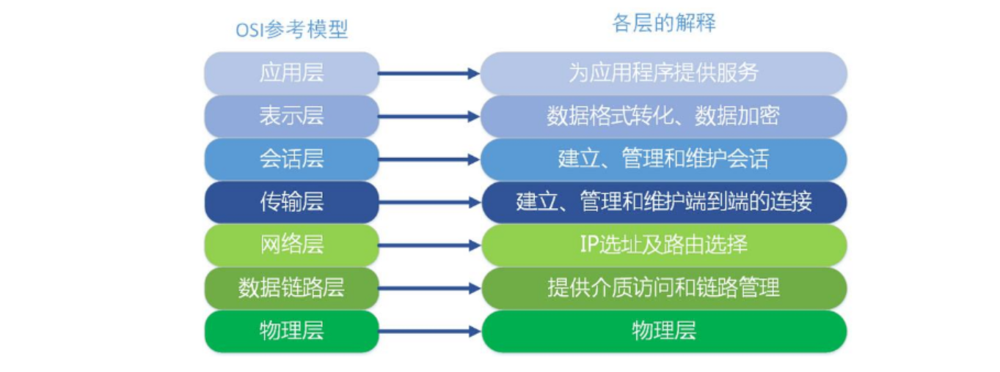
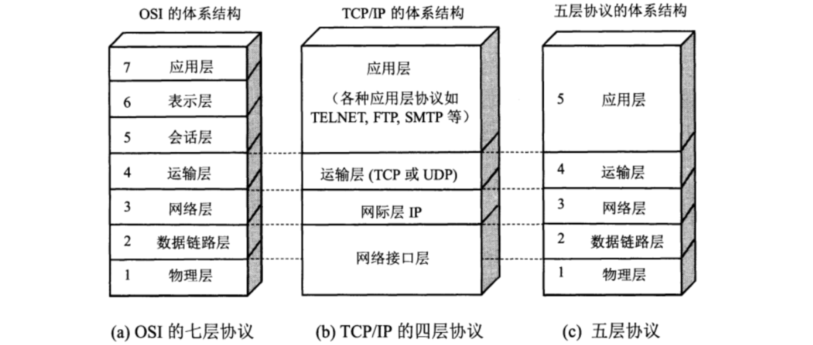
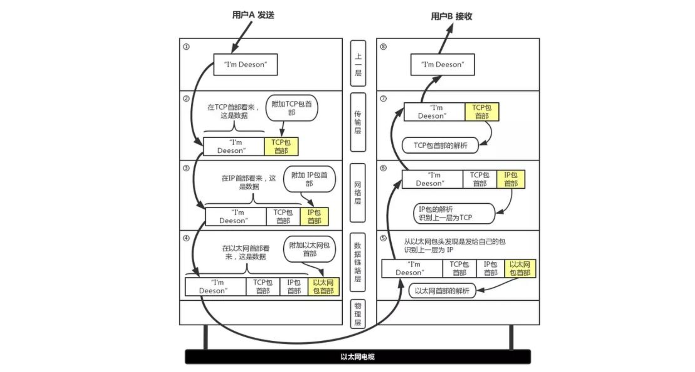

# 常用的计算机网络体系结构

## 1.OSI体系结构

1. 为了使不同体系结构的计算机网络都能够互联，国际标准化组织于1977年成立了专门机构研究该问题，不久他们就提出了一个试图使各种计算机在世界范围内都能够互连成网的标准框架，也就是著名的“**开放系统互连参考模型**”，**简称为OSI，OSI体系结构有时候我们也称之为OSI模型。**
2. OSI是一个**七层协议**的体系结构：从下往上依次是**物理层、数据链路层、网络层、运输层、会话层、表示层、应用层。**

3. OSI试图达到一种理想境界，即全球计算机网络都遵循这个统一标准，因而全球的计算机将能够很方便地进行互连和交换数据。在20世纪80年代，许多大公司甚至一些国家的政府机构纷纷表示支持OSI。当时看来似乎在不久的将来全世界一定会按照OSI制定的标准来构造自己的计算机网络。
4. 然而到了20世纪90年代初期，虽然整套的OSI国际标准都已经制定出来了，但由于基于TCP/IP 的互联网已抢先在全球相当大的范围成功地运行了，而与此同时却几乎找不到有什么厂家生产出符合OSI标准的商用产品。因此人们得出这样的结论：**OSI 只获得了一些理论研究的成果，但在市场化方面则事与愿违地失败了。**
5. **现今规模最大的、覆盖全球的、基于TCP/IP的互联网并未使用OSI标准。**
6. OSI失败的原因可归纳为:
   - **OSI的专家们缺乏实际经验，他们在完成OSI标准时缺乏商业驱动力;**
   - **OSI的协议实现起来过分复杂，而且运行效率很低;**
   - **OSI标准的制定周期太长，因而使得按OSI标准生产的设备无法及时进入市场;**
   - **OSI的层次划分不太合理，有些功能在多个层次中重复出现。**
7. OSI体系结构是法律上的国际标准， TCP/IP体系结构是事实上的国际标准

## 2.具有五层协议的体系结构

1. TCP/IP是一个**四层**的体系结构，它包含**应用层、运输层、网际层和网络接口层**（用网际层这个名字是强调这一层是为了解决不同网络的互连问题)。
2. OSI的七层协议体系结构概念清楚，理论也比较完整，但是太过于复杂不实用。TCP/IP体系结构不同，但是现在却得到了非常广泛的应用。
3. 在学习计算机网络的原理时往往采取折中的办法，即综合OSI和TCP/IP 的优点，**采用一种只有五层协议的体系结构**，这样既简洁又能将概念阐述清楚。有时为了方便，也可把最底下两层称为**网络接口层**。

4. 下面是结合互联网的情况，自上而下地，非常简要的介绍一下各层的主要功能。

### 2.1.应用层（application layer）

1. 应用层是体系结构中的最高层。应用层的任务是通过应用进程间的交互来完成特定网络应用。应用层协议定义的是应用进程间通信和交互的规则。这里的进程就是指主机中正在运行的程序。对于**不同的网络应用需要有不同的应用层协议**。在互联网中的应用层协议很多，如**域名系统DNS，支持万维网应用的 HTTP 协议，支持电子邮件的SMTP协议**，等等。**我们把应用层交互的数据单元称为报文(message)。**

### 2.2.传输层（transport layer）

1. 传输层的任务就是负责**向两台主机中进程之间的通信提供通用的数据传输服务**。
2. 传输层主要使用以下两种协议:
   - **传输控制协议TCP (Transmission Control Protocol)**：提供面向连接的、可靠的数据传输服务
   - **用户数据报协议UDP (User Datagram Protocol）**：提供无连接的、尽最大努力(best-effort)的数据传输服务（不保证数据传输的可靠性)
3. TCP和UDP协议都有固定的格式，数据在经过传输层时会根据所选择的运输协议在应用层传递过来的数据基础上加上对应协议的头部。

### 2.3.网络层（network layer）

1. 主要作用是实现**两个网络系统之间的数据透明传送**，具体包括**路由选择，拥塞控制和网际互连**等。
2. 在发送数据时，网络层把传输层产生的报文段或用户数据报封装成分组或包进行传送。在TCP/IP体系中，由于网络层使用IP协议，因此分组也叫做**IP数据报**，简称为**数据报**。
3. 数据在经过网络层时会加上IP协议的头部

### 2.4.数据链路层（data link layer）

1. 数据链路层常简称为链路层。我们知道，两台主机之间的数据传输，总是在一段一段的链路上传送的，这就需要使用专门的链路层的协议。在两个相邻结点之间传送数据时，数据链路层将网络层交下来的IP数据报**组装成帧(framing)**，在两个相邻结点间的链路上**传送帧(frame)**。每一帧包括数据和必要的**控制信息（如同步信息、地址信息、差错控制等）。**

### 2.5.物理层（physical layer）

1. 利用传输介质为数据链路层提供物理连接，实现比特流的透明传输。
2. **物理层上所传输数据的单位是比特。**

## 3.物理层

### 3.1.物理层的基本概念

1. 