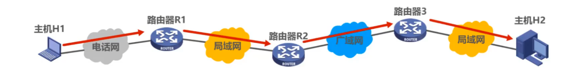
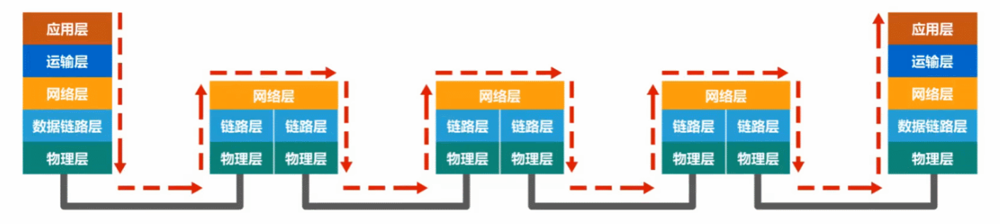
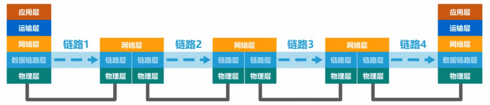

# 常用的计算机网络体系结构

## 1.OSI体系结构

1. 为了使不同体系结构的计算机网络都能够互联，国际标准化组织于1977年成立了专门机构研究该问题，不久他们就提出了一个试图使各种计算机在世界范围内都能够互连成网的标准框架，也就是著名的“**开放系统互连参考模型**”，**简称为OSI，OSI体系结构有时候我们也称之为OSI模型。**
2. OSI是一个**七层协议**的体系结构：从下往上依次是**物理层、数据链路层、网络层、运输层、会话层、表示层、应用层。**

3. OSI试图达到一种理想境界，即全球计算机网络都遵循这个统一标准，因而全球的计算机将能够很方便地进行互连和交换数据。在20世纪80年代，许多大公司甚至一些国家的政府机构纷纷表示支持OSI。当时看来似乎在不久的将来全世界一定会按照OSI制定的标准来构造自己的计算机网络。
4. 然而到了20世纪90年代初期，虽然整套的OSI国际标准都已经制定出来了，但由于基于TCP/IP 的互联网已抢先在全球相当大的范围成功地运行了，而与此同时却几乎找不到有什么厂家生产出符合OSI标准的商用产品。因此人们得出这样的结论：**OSI 只获得了一些理论研究的成果，但在市场化方面则事与愿违地失败了。**
5. **现今规模最大的、覆盖全球的、基于TCP/IP的互联网并未使用OSI标准。**
6. OSI失败的原因可归纳为:
   - **OSI的专家们缺乏实际经验，他们在完成OSI标准时缺乏商业驱动力;**
   - **OSI的协议实现起来过分复杂，而且运行效率很低;**
   - **OSI标准的制定周期太长，因而使得按OSI标准生产的设备无法及时进入市场;**
   - **OSI的层次划分不太合理，有些功能在多个层次中重复出现。**
7. OSI体系结构是法律上的国际标准， TCP/IP体系结构是事实上的国际标准

## 2.具有五层协议的体系结构

1. TCP/IP是一个**四层**的体系结构，它包含**应用层、运输层、网际层和网络接口层**（用网际层这个名字是强调这一层是为了解决不同网络的互连问题)。
2. OSI的七层协议体系结构概念清楚，理论也比较完整，但是太过于复杂不实用。TCP/IP体系结构不同，但是现在却得到了非常广泛的应用。
3. 在学习计算机网络的原理时往往采取折中的办法，即综合OSI和TCP/IP 的优点，**采用一种只有五层协议的体系结构**，这样既简洁又能将概念阐述清楚。有时为了方便，也可把最底下两层称为**网络接口层**。

4. 下面是结合互联网的情况，自上而下地，非常简要的介绍一下各层的主要功能。

### 2.1.应用层（application layer）

1. 应用层是体系结构中的最高层。应用层的任务是通过应用进程间的交互来完成特定网络应用。应用层协议定义的是应用进程间通信和交互的规则。这里的进程就是指主机中正在运行的程序。对于**不同的网络应用需要有不同的应用层协议**。在互联网中的应用层协议很多，如**域名系统DNS，支持万维网应用的 HTTP 协议，支持电子邮件的SMTP协议**，等等。**我们把应用层交互的数据单元称为报文(message)。**

### 2.2.传输层（transport layer）

1. 传输层的任务就是负责**向两台主机中进程之间的通信提供通用的数据传输服务**。
2. 传输层主要使用以下两种协议:
   - **传输控制协议TCP (Transmission Control Protocol)**：提供面向连接的、可靠的数据传输服务
   - **用户数据报协议UDP (User Datagram Protocol）**：提供无连接的、尽最大努力(best-effort)的数据传输服务（不保证数据传输的可靠性)
3. TCP和UDP协议都有固定的格式，数据在经过传输层时会根据所选择的运输协议在应用层传递过来的数据基础上加上对应协议的头部。

### 2.3.网络层（network layer）

1. 主要作用是实现**两个网络系统之间的数据透明传送**，具体包括**路由选择，拥塞控制和网际互连**等。
2. 在发送数据时，网络层把传输层产生的报文段或用户数据报封装成分组或包进行传送。在TCP/IP体系中，由于网络层使用IP协议，因此分组也叫做**IP数据报**，简称为**数据报**。
3. 数据在经过网络层时会加上IP协议的头部

### 2.4.数据链路层（data link layer）

1. **概念**：数据链路层常简称为链路层，位于物理层之上，负责在相邻节点之间提供可靠的数据传输服务。其核心任务是在物理层提供的原始比特传输服务上，**进行帧的组装、传输和接收。**通过将来自网络层的数据封装成帧，并通过链路层协议在两个相邻节点之间传输帧，数据链路层保证了数据的可靠性、顺序性和完整性。
2. **功能**：
   - **帧的封装与解封装**：
     - 数据链路层将网络层传递的数据打包为帧，并在每帧前后加上必要的控制信息（如帧头和帧尾），用于数据传输。
     - 当数据到达目的节点时，数据链路层会解封装，去掉帧头和帧尾，提取出数据交给网络层。
   - **物理地址寻址**：
     - 使用MAC地址进行硬件地址寻址。MAC地址是唯一分配给网络接口的地址，保证局域网内设备的通信。
     - 数据链路层通过MAC地址来识别和定位链路上的设备。
   - **差错检测与纠正**：
     - 数据链路层通过使用校验码（如CRC校验）来检测传输过程中是否发生了错误，若有错误则请求重新发送。
   - **帧的传输管理**：
     - 负责帧的序列控制和流量管理，以确保帧在网络中的顺序和速度可控。
3. 常见设备
   - **交换机**：工作在数据链路层，通过MAC地址转发数据帧。
   - **网卡（NIC）**：网络接口卡提供了数据链路层的功能，包括MAC地址的管理和数据帧的发送与接收。
4. **数据链路层在网络体系结构中所处的地位**
   - 如下图所示：**主机H1给主机H2发送数据，中间要经过三个路由器、电话网、局域网、广域网等多种网络。**

从五层协议原理体系结构的角度来看，主机应该具有体系结构中的各个层次，而路由器只需要具有体系结构中的网络层、数据链路层、物理层。网络中的各个设备通过传输媒体进行互连，主机H1将需要发送的数据**逐层封装**后通过物理层将构成数据包的各个比特转换为电信号发送到传输媒体，数据包进入到路由器后，**从下网上逐层解封到网络层**，路由器根据数据包的**目的网络地址**和**自身的转发表**确定数据包的转发端口，然后从网络层向下逐层封装数据包，最后通过物理层将数据包发送到传输媒体，最后到达主机H2，主机H2在接收到数据包后再逐层解封。

当我们研究数据链路层时，我们可以只关心数据链路层，而不考虑其他各层。我们可以想象，数据只在数据链路层从左至右沿水平方向传送。从数据链路层来看，主机H1到主机H2 的通信可以看作是在4段不同的链路上的通信所组成的。

#### 2.4.1. 

### 2.5.物理层（physical layer）

1. **概念**：物理层是网络通信的最底层，它负责传输比特流（0和1）在物理介质上的传递。物理层定义了网络设备之间如何通过物理介质（如铜线、电缆、光纤、无线电波等）传输原始数据，具体内容包括电气信号、电压、光信号的调制、传输速率、接口类型等。利用传输介质为数据链路层提供物理连接，实现比特流的透明传输。**物理层上所传输数据的单位是比特。**
2. 功能：
   - **比特传输**：负责将数据编码为适合传输介质的信号，并接收来自介质的信号，将其解码为比特流。
   - **物理连接**：提供端到端的物理连接，如网线、光纤或无线信道，确保数据从发送方传递到接收方。
   - **数据速率**：定义传输速率（带宽），即每秒钟传输的比特数量（bps，bits per second）。
   - **传输模式**：定义通信方式，如单工（单向通信）、半双工（双向但不同时通信）和全双工（同时双向通信）。
   - **物理拓扑**：定义网络中的物理连接方式，如星型、总线型、环型等拓扑结构。
   - **信号标准**：规定电气、电磁或光信号的形式和强度，以保证在不同介质上传输数据的有效性。
3. 常见设备：
   - 网线、光纤、无线信号发射器
   - 中继器、集线器（Hub）

