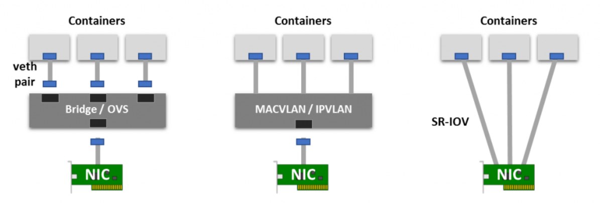
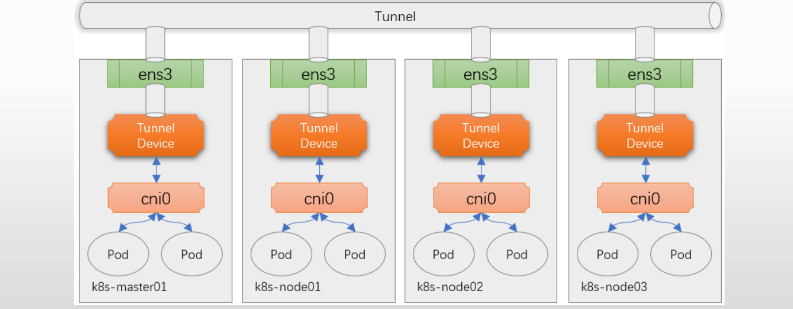
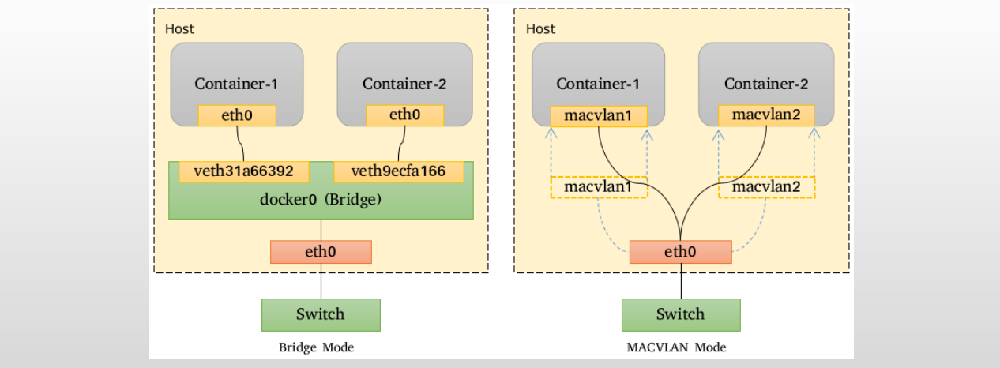
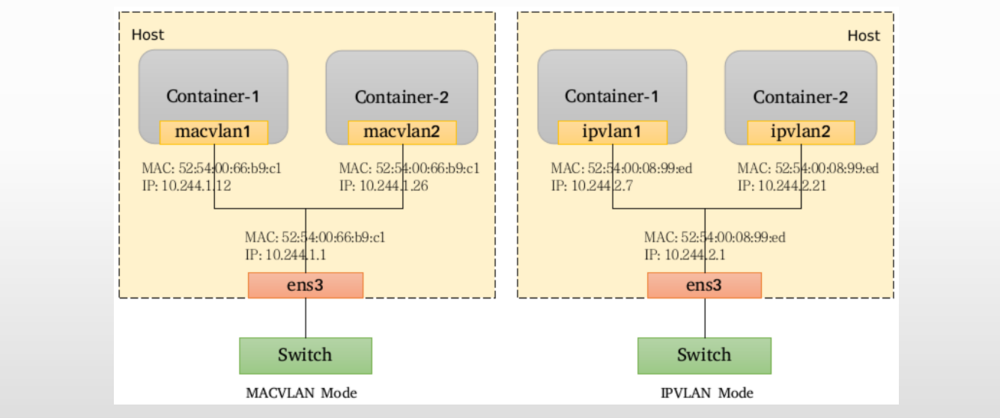
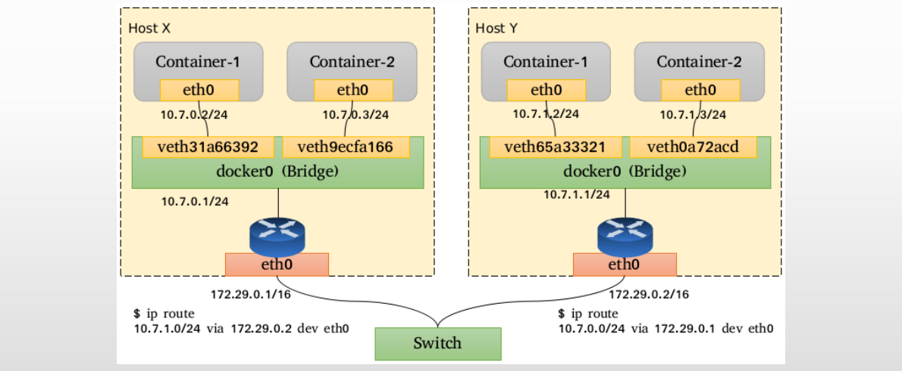

# CNI-Network

## 1.CNI网络插件基础

1. **概念**：CNI的全称为“**容器网络接口**”，它是容器引擎与遵循该规范网络插件的中间层，专用于为容器配置网络子系统
2. 简单来说，目前的CNI规范主要由**NetPlugin**（网络插件）和**IPAM**两个插件API组成
   - 网络插件也称Main插件，负责**创建/删除网络**以及**向网络添加/删除容器**。它专注于连通容器与容器之间以及容器与宿主机之间的通信，同容器相关网络设备通常都由该类插件所创建。
     - bridge、ipvlan、macvlan、loopback、ptp、veth以及vlan等虚拟设备。
   - IPAM的全称“IP Address Management”，该类插件负责**创建/删除地址池**以及**分配/回收容器的IP地址**。目前，该类型插件的实现主要有host-local和dhcp两个，前一个基于预置的地址范围进行地址分配，而后一个通过dhcp协议获取地址。

## 2.配置容器网络接口的常用方法

1. 不同的容器虚拟化网络解决方案中为Pod的网络名称空间创建虚拟接口设备的方式也会有所不同，目前，较为注流的实现方式有虚拟以太网设备（veth）、多路复用及硬件交换三种。
   - **veth设备**：创建一个网桥，并为每个容器创建一对虚拟以太网接口（veth），一个接入容器内部，另一个留置于根名称空间内添加为Linux内核桥接功能或OpenVSwitch（OVS）网桥的从设备
   - **多路复用**：多路复用可以由一个中间网络设备组成，它暴露多个虚拟接口，使用数据包转发规则来控制每个数据包转到的目标接口。MACVLAN技术为每个虚拟接口配置一个MAC地址并基于此地址完成二层报文收发，IPVLAN则是分配一个IP地址并共享单个MAC并根据目标IP完成容器报文转发。
   - **硬件交换**：现今市面上有相当数量的NIC都支持单根I/O虚拟化（SR-IOV），它是创建虚拟设备的一种实现方式，每个虚拟设备自身表现为一个独立的PCI设备，并有着自己的VLAN及硬件强制关联的QoS；SR-IOV提供了接近硬件级别的性能；

## 3.Kubernetes的网络解决方案

1. NetPlugin目前常用的实现方案有**叠加网络**（Overlay Network）和**承载网络**（Underlay Network）两类：
   - **叠加网络**借助于VXLAN、UDP、IPIP或GRE等隧道协议，通过隧道协议报文封装Pod间的通信报文（IP报文或以太网帧）来构建虚拟网络。
   - **承载网络**通常使用direct routing（直接路由）技术在Pod的各子网间路由Pod的IP报文，或使用bridge、macvlan或ipvlan等技术直接将容器暴露至外部网络中
2. 叠加网络的底层网络也就是承载网络
   - 承载网络的解决方案也就是一类非借助于隧道协议而构建的容器通信网络
   - 相较于承载网络，叠加网络由于存在额外的隧道报文封装，会存在一定程度的性能开销
   - 但希望创建跨越多个L2或L3的逻辑网络子网时，只能借助于叠加封装协议实现

### 3.1.Overlay网络模型

>**Overlay 网络模型**是一种网络虚拟化技术，通过在现有的物理网络（underlay network）之上构建逻辑网络来实现虚拟化和隔离。它可以将多个虚拟网络或子网在同一物理网络上运行，而这些虚拟网络之间彼此隔离，互不影响。Overlay 网络将虚拟网络的拓扑和操作独立于底层的物理网络。虚拟机（VM）或容器之间的通信通过封装的方式在物理网络上传输，不需要底层网络了解其虚拟网络结构。

1. VXLAN（Virtual eXtensible Local Area Network，虚拟扩展局域网）：**VXLAN**（**Virtual Extensible LAN**，虚拟扩展局域网）是一种网络虚拟化技术，主要用于解决传统 VLAN 在大规模数据中心中的扩展性问题。VXLAN 的核心思想是通过在现有的 IP 网络上创建虚拟二层网络，从而实现跨物理网络的虚拟机和容器的通信。

2. 目前最流行的叠加网络隧道协议之一，也是由IETF定义的NVO3（Network Virtualization over Layer 3）标准技术之一

3. 采用L2 over L4（MAC-in-UDP）的报文封装模式，将二层报文用三层协议进行封装，可实现二层网络在三层范围内进行扩展。

   

4. VXLAN 的主要特点：

   - **网络隔离**：VXLAN 使用 24 位的 VXLAN 网络标识符（VNI），支持多达 16,777,216 个隔离的虚拟网络（相比传统 VLAN 的 4096 个大大增加了网络隔离的容量）。
   - **二层网络扩展**：VXLAN 将二层的以太网帧封装到三层的 IP 数据包中，通过 IP 网络进行传输，从而实现跨物理网络的二层通信。
   - **封装机制**：VXLAN 封装二层的以太网帧在 UDP 数据包中传输，源 VTEP（VXLAN Tunnel Endpoint）负责封装操作，而目标 VTEP 负责解封装。
   - **UDP 隧道**：VXLAN 利用 UDP 隧道在三层 IP 网络上传输二层流量，因此能够在现有的 IP 基础设施上实现虚拟网络，无需修改底层网络设备。

5. VXLAN 的主要作用：

   - **大规模虚拟网络的支持**：通过 VXLAN，数据中心能够支持成千上万个虚拟网络，而不受传统 VLAN 数量限制。
   - **跨数据中心的二层通信**：VXLAN 允许在不同的数据中心间跨越三层 IP 网络实现虚拟机或容器的通信。
   - **网络虚拟化**：VXLAN 是常用于云计算环境和容器平台（如 Kubernetes）的网络虚拟化方案之一，通过它实现虚拟机和容器的网络隔离和灵活调度。

6. VXLAN 的应用场景：

   - **云计算和数据中心**：用于为不同的租户提供隔离的虚拟网络。
   - **容器和虚拟机网络**：用于连接跨物理节点的容器或虚拟机，使它们能够像在同一二层网络中一样通信。
   - **跨地域数据中心网络扩展**：可以实现不同地域数据中心的二层互联。

### 3.2.Underlay网络模型

>**Underlay 网络模型**是指实际运行在物理网络设备和基础设施上的网络。它是数据在网络节点之间的底层传输路径，负责通过物理连接（如路由器、交换机、物理链路等）实现 IP 层的通信。Underlay 网络通常用于支撑虚拟化的 Overlay 网络，是 Overlay 网络数据封装和传输的基础。

1. 容器网络中的承载网络是指借助驱动程序将宿主机的底层网络接口直接暴露给容器使用的一种网络构建技术，较为常见的解决方案有macvlan、ipvlan和直接路由等

2. **MACVLAN**：

   - MACVLAN支持在同一个以太网接口上虚拟出多个网络接口，每个虚拟接口都拥有惟一的MAC地址，并可按需配置IP地址
   - MACVLAN允许传输广播和多播流量，它要求物理接口工作于混杂模式
   - 与Bridge模式相比，MACVLAN不再依赖虚拟网桥、NAT和端口映射，它允许容器以虚拟接口方式直接连接至物理接口

   

3. **IPVLAN**：

   - IPVLAN类似于MACVLAN，它同样创建新的虚拟网络接口并为每个接口分配惟一的IP地址，不同之处在于，每个虚拟接口将共享使用物理接口的MAC地址，从而不再违反防止MAC欺骗的交换机的安全策略，且不要求在物理接口上启用混杂模式

   

4. Direct Routing（直接路由）：

   - 放弃跨主机的容器在L2的连通性，而专注于通过路由协议解决它们在L3的通信的解决方案通常可简称为“直接路由”模型
   - 跨主机的容器间通信，需要借助于主机上的路由表指示完成报文路由，因此每个主机的物理接口地址都有可能被引用为另一个主机路由报文时的“下一跳（nexthop）”，这就要求各主机的物理接口必须位于同一个L2网络中

   

## 4.选择网络插件

1. 通常来说，选择网络插件时应该通过底层系统环境限制、容器网络的功能需求和性能需求三个重要的评估标准来衡量插件的适用性
   - **底层系统环境限制**：公有云环境多有专有的实现，例如Google GCE、Azure CNI、AWS VPC CNI和AliyunTerway等，它们通常是相应环境上较佳的选择；否则，虚拟化环境限制较多，除叠加网络模型别无选择，可用有Flannel vxlan、Calico ipip、Weave和Antrea等；物理机环境几乎支持任何类型的网络插件，此时一般应该选择性能较好的的Calico BGP、Flannel host-gw或DAMM IPVLAN等
   - **容器网络功能需求**：支持NetworkPolicy的解决方案以Calico、WeaveNet和Antrea为代表，而且后两个支持节点到节点间的通信加密；而大量Pod需要与集群外部资源互联互通时应该选择承载网络模型一类的解决方案
   - **容器网络性能需求**：Overlay网络中的协议报文有隧道开销，性能略差，而Underlay网络则几乎不存这方面的问题；但Overlay或Underlay路由模型的网络插件支持较快的Pod创建速度，而Underlay模型中IPVLAN或MACVLAN模式中较慢
2. 更少的资源消耗及更好的性能，选flannel
3. 更在意网络加密等安全因素，选WeaveNet
4. 更好的各因素的均衡特征，选Calico