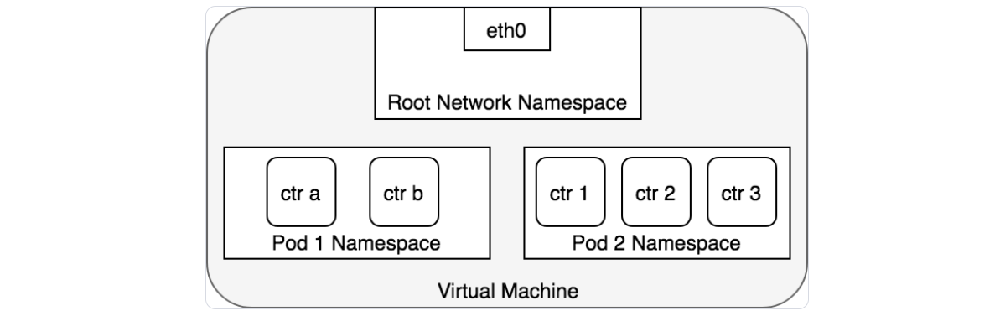
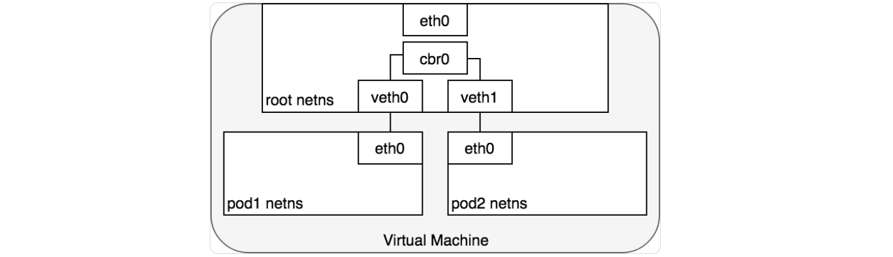
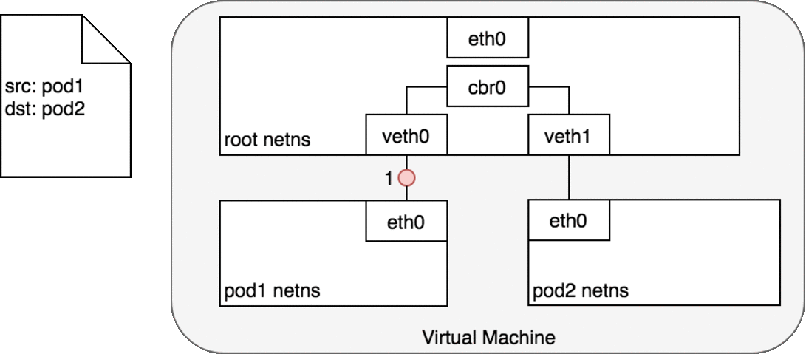
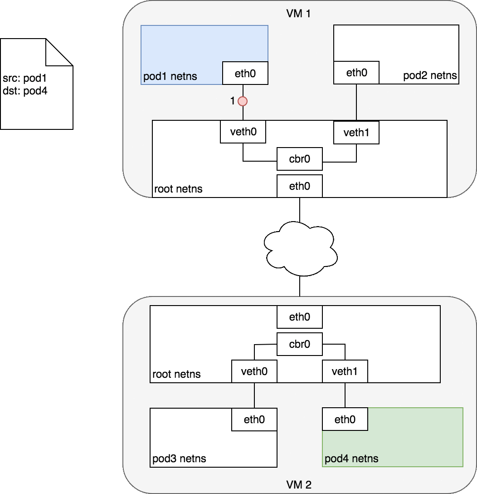

# Kubernetes网络模型

>Kubernetes 网络模型是指 Kubernetes 集群中的 Pod、服务和其他组件之间的通信方式。它为集群中的应用和服务提供了灵活的网络基础设施，并通过插件化的架构支持不同的网络实现方式。Kubernetes 的网络模型本质上是为了确保集群中的所有 Pod 和服务能够在一个扁平的、无障碍的网络环境中通信。

1. 关于 Pod 如何接入网络这件事情，Kubernetes 做出了明确的选择。具体来说，Kubernetes 要求所有的网络插件实现必须满足如下要求：
   - 所有的 Pod 可以与任何其他 Pod 直接通信，无需使用 NAT 映射（network address translation）
   - 所有节点可以与所有 Pod 直接通信，无需使用 NAT 映射
   - Pod 内部获取到的 IP 地址与其他 Pod 或节点与其通信时的 IP 地址是同一个
2. 在这些限制条件下，需要解决如下四种完全不同的网络使用场景的问题：
   - Container-to-Container 的网络
   - Pod-to-Pod 的网络
   - Pod-to-Service 的网络
   - Internet-to-Service 的网络

## 1.Container-to-Container的网络

>在 Kubernetes 和 Docker 等容器化平台中，**容器间网络（Container-to-Container Network）** 是指同一个 Pod 内的多个容器之间的通信方式。因为一个 Pod 可以包含多个容器，这些容器需要通过某种网络机制相互通信，以共同完成一个任务。

1. Container-to-Container 网络的关键特点
   - **共享网络命名空间**：
     - Kubernetes 和 Docker 使用网络命名空间来隔离网络资源。Pod 中的所有容器共享相同的网络命名空间，这意味着这些容器共享相同的网络接口、IP 地址、端口空间。
     - 由于它们共享同一网络命名空间，Pod 中的所有容器可以直接通过 `localhost` 和端口进行通信，而不需要使用外部的网络接口。
   - **本地通信**：
     - 容器间的通信是通过本地主机（localhost）进行的，通信效率很高，因为不需要跨节点或跨网络传输数据。
     - 同一 Pod 内的容器可以像普通进程一样使用 `localhost` 加端口号进行相互通信。例如，一个容器可以通过 `localhost:8080` 访问另一个容器提供的服务。
   - **独立的存储和计算资源**：
     - 尽管容器共享网络命名空间，Pod 内的每个容器仍然拥有独立的文件系统、计算资源（如 CPU 和内存）等。这允许它们分别运行不同的应用或服务，但通过本地网络通信互相协作。
2. Container-to-Container 网络的优势
   - **简化了容器间通信**：
     - 同一个 Pod 中的容器共享网络资源，因此不需要配置额外的网络或端口映射，这使得容器之间的通信非常直接和高效。
   - **性能高**：
     - 由于通信是在同一个主机的网络命名空间内进行的，因此性能较好，尤其是对于同一 Pod 内的容器，延迟极低。
   - **减少网络配置开销**：
     - Pod 内的容器不需要通过外部网络或服务发现机制进行通信，只需通过 `localhost` 即可进行请求和响应。
3. 在 Kubernetes 中，Pod 是一组 docker 容器的集合，这一组 docker 容器将共享一个 network namespace。Pod 中所有的容器都使用该 network namespace 提供的同一个 IP 地址以及同一个端口空间，可以通过 localhost 直接与同一个 Pod 中的另一个容器通信。
4. Kubernetes 为每一个 Pod 都创建了一个 network namespace。具体做法是，把一个 Docker 容器当做 “Pod Container” 用来获取 network namespace，在创建 Pod 中新的容器时，都使用 docker run 的 `--network:container` 功能来加入该 network namespace，如下图所示，每一个 Pod 都包含了多个 docker 容器（`ctr*`），这些容器都在同一个共享的 network namespace 中：

## 2.Pod-to-Pod的网络

>1. 在 Kubernetes 中，每一个 Pod 都有一个真实的 IP 地址，并且每一个 Pod 都可以使用此 IP 地址与 其他 Pod 通信。不管两个 Pod 是在同一个节点上，还是集群中的不同节点上。
>2. 从 Pod 的视角来看，Pod 是在其自身所在的 network namespace 与同节点上另外一个 network namespace 进程通信。在Linux上，不同的 network namespace 可以通过 ***veth pair*** (两块跨多个名称空间的虚拟网卡)进行通信。为连接 pod 的 network namespace，可以将 ***veth pair*** 的一段指定到 root network namespace，另一端指定到 Pod 的 network namespace。每一组 ***veth pair*** 类似于一条网线，连接两端，并可以使流量通过。
>3. 节点上有多少个 Pod，就会设置多少组 ***veth pair***。下图展示了 veth pair 连接 Pod 到 root namespace 的情况：

>4. 此时，我们的 Pod 都有了自己的 network namespace，从 Pod 的角度来看，他们都有自己的以太网卡以及 IP 地址，并且都连接到了节点的 root network namespace。为了让 Pod 可以互相通过 root network namespace 通信，我们将使用 network bridge（网桥）。
>5. Linux Ethernet bridge 是一个虚拟的 Layer 2 网络设备，可用来连接两个或多个网段（network segment）。
>   - **网桥的工作原理**：在源于目标之间维护一个转发表（forwarding table），通过检查通过网桥的数据包的目标地址（destination）和该转发表来决定是否将数据包转发到与网桥相连的另一个网段。桥接代码通过网络中具备唯一性的网卡MAC地址来判断是否桥接或丢弃数据。
>6. 网桥实现了 [ARP (opens new window)](https://en.wikipedia.org/wiki/Address_Resolution_Protocol)协议，以发现链路层与 IP 地址绑定的 MAC 地址。当网桥收到数据帧时，网桥将该数据帧广播到所有连接的设备上（除了发送者以外），对该数据帧做出相应的设备被记录到一个查找表中（lookup table）。后续网桥再收到发向同一个 IP 地址的流量时，将使用查找表（lookup table）来找到对应的 MAC 地址，并转发数据包。

### 2.1.数据包的传递：Pod-to-Pod（同节点）

1. 在 network namespace 将每一个 Pod 隔离到各自的网络堆栈的情况下，虚拟以太网设备（virtual Ethernet device）将每一个 namespace 连接到 root namespace，网桥将 namespace 又连接到一起，此时，Pod 可以向同一节点上的另一个 Pod 发送网络报文了。下图演示了同节点上，网络报文从一个Pod传递到另一个Pod的情况。

2. Pod1 发送一个数据包到其自己的默认以太网设备 `eth0`。对 Pod1 来说，`eth0` 通过虚拟以太网设备（veth0）连接到 root namespace
3. 网桥 `cbr0` 中为 `veth0` 配置了一个网段。一旦数据包到达网桥，网桥使用[ARP (opens new window)](https://en.wikipedia.org/wiki/Address_Resolution_Protocol)协议解析出其正确的目标网段 `veth1`。网桥 `cbr0` 将数据包发送到 `veth1`
4. 数据包到达 `veth1` 时，被直接转发到 Pod2 的 network namespace 中的 `eth0` 网络设备。
5. 在整个数据包传递过程中，每一个 Pod 都只和 `localhost` 上的 `eth0` 通信，且数包被路由到正确的 Pod 上。

>Kubernetes 的网络模型规定，在跨节点的情况下 Pod 也必须可以通过 IP 地址访问。也就是说，Pod 的 IP 地址必须始终对集群中其他 Pod 可见；且从 Pod 内部和从 Pod 外部来看，Pod 的IP地址都是相同的。

### 2.2.数据包的传递：Pod-to-Pod（跨节点）

>1. Kubernetes 网络模型要求 Pod 的 IP 在整个网络中都可访问，但是并不指定如何实现这一点。实际上，这是所使用网络插件相关的，但是，仍然有一些模式已经被确立了。
>2. 通常，集群中每个节点都被分配了一个 CIDR 网段，指定了该节点上的 Pod 可用的 IP 地址段。一旦发送到该 CIDR 网段的流量到达节点，就由节点负责将流量继续转发给对应的 Pod。下图展示了两个节点之间的数据报文传递过程。

>图中，目标 Pod（以绿色高亮）与源 Pod（以蓝色高亮）在不同的节点上，数据包传递过程如下：

1. 数据包从 Pod1 的网络设备 `eth0`，该设备通过 `veth0` 连接到 root namespace
2. 数据包到达 root namespace 中的网桥 `cbr0`
3. 网桥上执行 ARP 将会失败，因为与网桥连接的所有设备中，没有与该数据包匹配的 MAC 地址。一旦 ARP 失败，网桥会将数据包发送到默认路由（root namespace 中的 `eth0` 设备）。此时，数据包离开节点进入网络
4. 数据包进入目标节点的 root namespace（VM2 上的 `eth0`）后，通过网桥路由到正确的虚拟网络设备（`veth1`）
5. 最终，数据包通过 `veth1` 发送到对应 Pod 的 `eth0`，完成了数据包传递的过程
6. 通常来说，每个节点知道如何将数据包分发到运行在该节点上的 Pod。一旦一个数据包到达目标节点，数据包的传递方式与同节点上不同Pod之间数据包传递的方式就是一样的了。

## 3.Pod-to-Service的网络

>1. Pod 的 IP 地址并非是固定不变的，随着 Pod 的重新调度（例如水平伸缩、应用程序崩溃、节点重启等），Pod 的 IP 地址将会出现又消失。此时，Pod 的客户端无法得知该访问哪一个 IP 地址。Kubernetes 中，Service 的概念用于解决此问题。
>2. 一个 Kubernetes Service 管理了一组 Pod 的状态，可以追踪一组 Pod 的 IP 地址的动态变化过程。一个 Service 拥有一个 IP 地址，并且充当了一组 Pod 的 IP 地址的“虚拟 IP 地址”。任何发送到 Service 的 IP 地址的数据包将被负载均衡到该 Service 对应的 Pod 上。
>3. 在此情况下，Service 关联的 Pod 可以随时间动态变化，客户端只需要知道 Service 的 IP 地址即可（该地址不会发生变化）。
>4. 从效果上来说，Kubernetes 自动为 Service 创建和维护了集群内部的分布式负载均衡，可以将发送到 Service IP 地址的数据包分发到 Service 对应的健康的 Pod 上。