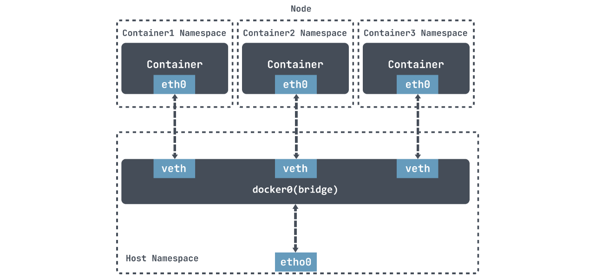
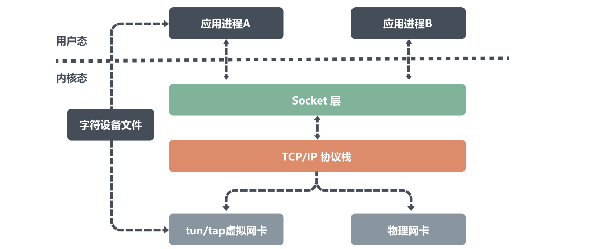
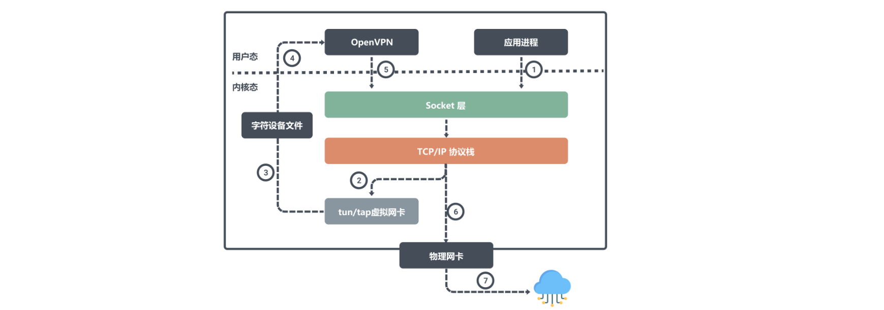
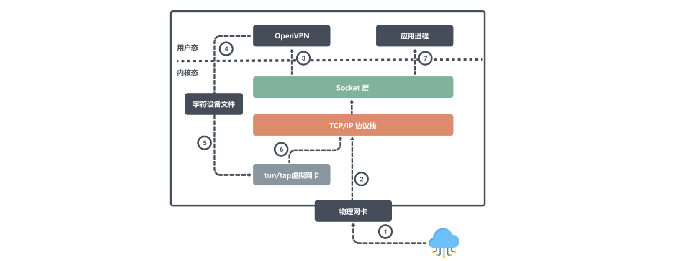
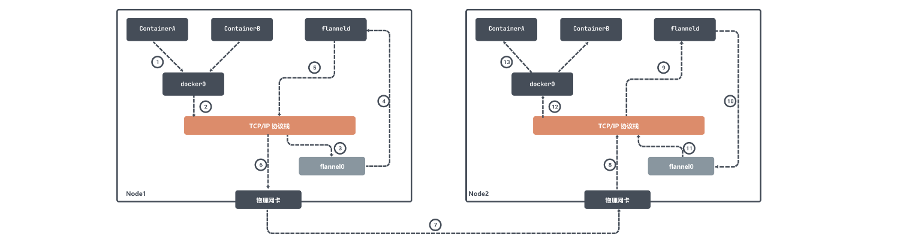
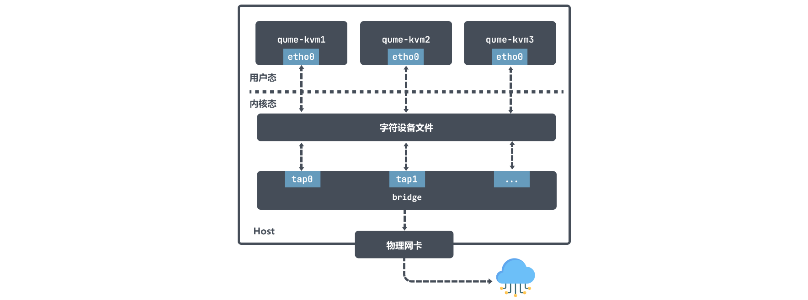
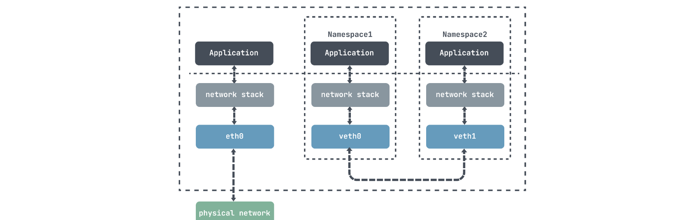

# 云原生虚拟网络 tun/tap & veth-pair

## 1.概述

1. 目前主流的虚拟网卡方案有tun/tap和veth两种。在时间上 tun/tap 出现得更早，在 Linux Kernel 2.4 版之后发布的内核都会默认编译 tun/tap 的驱动。并且 tun/tap 应用非常广泛，其中云原生虚拟网络中， flannel 的 UDP 模式中的 flannel0 就是一个 tun 设备，OpenVPN 也利用到了 tun/tap 进行数据的转发
2. veth 是另一种主流的虚拟网卡方案，在 Linux Kernel 2.6 版本，Linux 开始支持网络名空间隔离的同时，也提供了专门的虚拟以太网（Virtual Ethernet，习惯简写做 veth）让两个隔离的网络名称空间之间可以互相通信。veth 实际上不是一个设备，而是一对设备，因而也常被称作 Veth-Pair。
3. Docker 中的 Bridge 模式就是依靠 veth-pair 连接到 docker0 网桥上与宿主机乃至外界的其他机器通信的。

## 2.tun/tap

1. tun 和 tap 是两个相对独立的虚拟网络设备，它们作为虚拟网卡，除了不具备物理网卡的硬件功能外，它们和物理网卡的功能是一样的，此外tun/tap负责在内核网络协议栈和用户空间之间传输数据。
   - tun 设备是一个三层网络层设备，从 /dev/net/tun 字符设备上读取的是 IP 数据包，写入的也只能是 IP 数据包，因此常用于一些点对点IP隧道，例如OpenVPN，IPSec等；
   - tap 设备是二层链路层设备，等同于一个以太网设备，从 /dev/tap0 字符设备上读取 MAC 层数据帧，写入的也只能是 MAC 层数据帧，因此常用来作为虚拟机模拟网卡使用；

2. 从上面图中，我们可以看出物理网卡和 tun/tap 设备模拟的虚拟网卡的区别，虽然它们的一端都是连着网络协议栈，但是物理网卡另一端连接的是物理网络，而 tun/tap 设备另一端连接的是一个文件作为传输通道。
3. 虚拟网卡主要有两个功能，一个是连接其它设备（虚拟网卡或物理网卡）和 Bridge 这是 tap 设备的作用；另一个是提供用户空间程序去收发虚拟网卡上的数据，这是 tun 设备的作用。
4. 主要区别是因为它们作用在不同的网络协议层，换句话说 tap设备是一个二层设备所以通常接入到 Bridge上作为局域网的一个节点，tun设备是一个三层设备通常用来实现 vpn。

### 2.1.OpenVPN 使用 tun 设备收发数据

1. OpenVPN 是使用 tun 设备的常见例子，它可以方便的在不同网络访问场所之间搭建类似于局域网的专用网络通道。其核心机制就是在 OpenVPN 服务器和客户端所在的计算机上都安装一个 tun 设备，通过其虚拟 IP 实现相互访问。
2. 例如公网上的两个主机节点A、B，物理网卡上配置的IP分别是 ipA_eth0 和 ipB_eth0。然后在A、B两个节点上分别运行 openvpn 的客户端和服务端，它们会在自己的节点上创建 tun 设备，且都会读取或写入这个 tun 设备。
3. 假设这两个设备对应的虚拟 IP 是 ipA_tun0 和 ipB_tun0，那么节点 B 上面的应用程序想要通过虚拟 IP 对节点 A 通信，那么数据包流向就是：

4. 用户进程对 ipA_tun0 发起请求，经过路由决策后内核将数据从网络协议栈写入 tun0 设备；然后 OpenVPN 从字符设备文件中读取 tun0 设备数据，将数据请求发出去；内核网络协议栈根据路由决策将数据从本机的 eth0 接口流出发往 ipA_eth0 。
5. 同样我们来看看节点 A 是如何接受数据：

6. 当节点A 通过物理网卡 eth0 接受到数据后会将写入内核网络协议栈，因为目标端口号是OpenVPN程序所监听的，所以网络协议栈会将数据交给 OpenVPN ；
7. OpenVPN 程序得到数据之后，发现目标IP是tun0设备的，于是将数据从用户空间写入到字符设备文件中，然后 tun0 设备会将数据写入到协议栈中，网络协议栈最终将数据转发给应用进程。

>从上面我们知道使用 tun/tap 设备传输数据需要经过两次协议栈，不可避免地会有一定的性能损耗，如果条件允许，容器对容器的直接通信并不会把 tun/tap 作为首选方案，一般是基于稍后介绍的 veth 来实现的。但是 tun/tap 没有 veth 那样要求设备成对出现、数据要原样传输的限制，数据包到用户态程序后，程序员就有完全掌控的权力，要进行哪些修改，要发送到什么地方，都可以编写代码去实现，因此 tun/tap 方案比起 veth 方案有更广泛的适用范围。

### 2.2.flannel UDP 模式使用 tun 设备收发数据

1. 早期 flannel 利用 tun 设备实现了 UDP 模式下的跨主网络相互访问，实际上原理和上面的 OpenVPN 是差不多的。
2. 在 flannel 中 flannel0 是一个三层的 tun 设备，用作在操作系统内核和用户应用程序之间传递 IP 包。当操作系统将一个 IP 包发送给 flannel0 设备之后，flannel0 就会把这个 IP 包，交给创建这个设备的应用程序，也就是 flanneld 进程，flanneld 进程是一个 UDP 进程，负责处理 flannel0 发送过来的数据包：

3. flanneld 进程会根据目的 IP 的地址匹配到对应的子网，从 Etcd 中找到这个子网对应的宿主机 Node2 的 IP 地址，然后将这个数据包直接封装在 UDP 包里面，然后发送给 Node 2。由于每台宿主机上的 flanneld 都监听着一个 8285 端口，所以 Node2 机器上 flanneld 进程会从 8285 端口获取到传过来的数据，解析出封装在里面的发给 ContainerA 的 IP 地址。
4. flanneld 会直接把这个 IP 包发送给它所管理的 TUN 设备，即 flannel0 设备。然后网络栈会将这个数据包根据路由发送到 docker0 网桥，docker0 网桥会扮演二层交换机的角色，将数据包发送给正确的端口，进而通过 veth pair 设备进入到 containerA 的 Network Namespace 里。

>上面所讲的 Flannel UDP 模式现在已经废弃，原因就是因为它经过三次用户态与内核态之间的数据拷贝。容器发送数据包经过 docker0 网桥进入内核态一次；数据包由 flannel0 设备进入到 flanneld 进程又一次；第三次是 flanneld 进行 UDP 封包之后重新进入内核态，将 UDP 包通过宿主机的 eth0 发出去。

### 2.3.tap 设备作为虚拟机网卡

1. ap 设备是一个二层链路层设备，通常用作实现虚拟网卡。以 qemu-kvm 为例，它利用 tap 设备和 Bridge 配合使用拥有极大的灵活性，可以实现各种各样的网络拓扑。

2. 在 qume-kvm 开启 tap 模式之后，在启动的时候会向内核注册了一个tap类型虚拟网卡 tapx，x 代表依次递增的数字； 这个虚拟网卡 tapx 是绑定在 Bridge 上面的，是它上面的一个接口，最终数据会通过 Bridge 来进行转发。
3. qume-kvm 会通过其网卡 eth0 向外发送数据，从 Host 角度看就是用户层程序 qume-kvm 进程将字符设备写入数据；然后 tapx 设备会收到数据后由 Bridge 决定数据包如何转发。如果 qume-kvm 要和外界通信，那么数据包会被发送到物理网卡，最终实现与外部通信。

>从上面的图也可以看出 qume-kvm 发出的数据包通过 tap 设备先到达 Bridge ，然后到物理网络中，数据包不需要经过主机的的协议栈，这样效率也比较高。

### 2.4.veth-pair

1. veth-pair 就是一对的虚拟设备接口，它是成对出现的，一端连着协议栈，一端彼此相连着，在 veth 设备的其中一端输入数据，这些数据就会从设备的另外一端原样不变地流出：

2. 利用它可以连接各种虚拟设备，两个 namespace 设备之间的连接就可以通过 veth-pair 来传输数据。
3. 构造一个 ns1 和 ns2 利用 veth 通信的过程，看看veth是如何收发请求包的:

~~~shell
# 创建两个namespace
ip netns add ns1
ip netns add ns2

# 通过ip link命令添加vethDemo0和vethDemo1
ip link add vethDemo0 type veth peer name vethDemo1

# 将 vethDemo0 vethDemo1 分别加入两个 ns
ip link set vethDemo0 netns ns1
ip link set vethDemo1 netns ns2

# 给两个 vethDemo0 vethDemo1  配上 IP 并启用
ip netns exec ns1 ip addr add 10.1.1.2/24 dev vethDemo0
ip netns exec ns1 ip link set vethDemo0 up

ip netns exec ns2 ip addr add 10.1.1.3/24 dev vethDemo1
ip netns exec ns2 ip link set vethDemo1 up

# 然后我们可以看到 namespace 里面设置好了各自的虚拟网卡以及对应的ip：

~ # ip netns exec ns1 ip addr    

root@VM_243_186_centos
1: lo: <LOOPBACK> mtu 65536 qdisc noop state DOWN group default
    link/loopback 00:00:00:00:00:00 brd 00:00:00:00:00:00
7: vethDemo0: <BROADCAST,MULTICAST,UP,LOWER_UP> mtu 1500 qdisc pfifo_fast state UP group default qlen 1000
    link/ether d2:3f:ea:b1:be:57 brd ff:ff:ff:ff:ff:ff
    inet 10.1.1.2/24 scope global vethDemo0
       valid_lft forever preferred_lft forever
    inet6 fe80::d03f:eaff:feb1:be57/64 scope link
       valid_lft forever preferred_lft forever
       
# 然后我们 ping vethDemo1 设备的 ip：
ip netns exec ns1 ping 10.1.1.3

root@VM_243_186_centos~ # ip netns exec ns1 tcpdump -n -i vethDemo0                                           
tcpdump: verbose output suppressed, use -v or -vv for full protocol decode
listening on vethDemo0, link-type EN10MB (Ethernet), capture size 262144 bytes
20:19:14.339853 ARP, Request who-has 10.1.1.3 tell 10.1.1.2, length 28
20:19:14.339877 ARP, Reply 10.1.1.3 is-at 0e:2f:e6:ce:4b:36, length 28
20:19:14.339880 IP 10.1.1.2 > 10.1.1.3: ICMP echo request, id 27402, seq 1, length 64
20:19:14.339894 IP 10.1.1.3 > 10.1.1.2: ICMP echo reply, id 27402, seq 1, length 64

root@VM_243_186_centos ~ # ip netns exec ns2 tcpdump -n -i vethDemo1                                           
tcpdump: verbose output suppressed, use -v or -vv for full protocol decode
listening on vethDemo1, link-type EN10MB (Ethernet), capture size 262144 bytes
20:19:14.339862 ARP, Request who-has 10.1.1.3 tell 10.1.1.2, length 28
20:19:14.339877 ARP, Reply 10.1.1.3 is-at 0e:2f:e6:ce:4b:36, length 28
20:19:14.339881 IP 10.1.1.2 > 10.1.1.3: ICMP echo request, id 27402, seq 1, length 64
20:19:14.339893 IP 10.1.1.3 > 10.1.1.2: ICMP echo reply, id 27402, seq 1, length 64
~~~

1. ping进程构造ICMP echo请求包，并通过socket发给协议栈；
2. 协议栈根据目的IP地址和系统路由表，知道去 10.1.1.3 的数据包应该要由 10.1.1.2 口出去；
3. 由于是第一次访问 10.1.1.3，刚开始没有它的 mac 地址，所以协议栈会先发送 ARP 出去，询问 10.1.1.3 的 mac 地址；
4. 协议栈将 ARP 包交给 vethDemo0，让它发出去；
5. 由于 vethDemo0 的另一端连的是 vethDemo1，所以ARP请求包就转发给了 vethDemo1；
6. vethDemo1 收到 ARP 包后，转交给另一端的协议栈，做出 ARP 应答，回应告诉 mac 地址 ；
7. 当拿到10.1.1.3 的 mac 地址之后，再发出 ping 请求会构造一个ICMP request 发送给目的地，然后ping命令回显成功；

