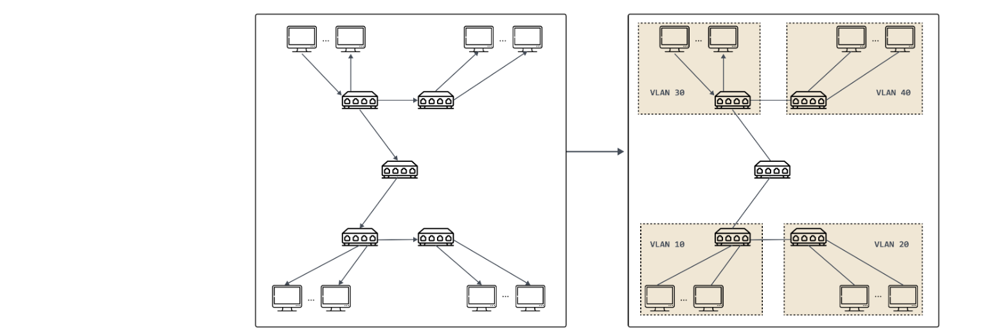
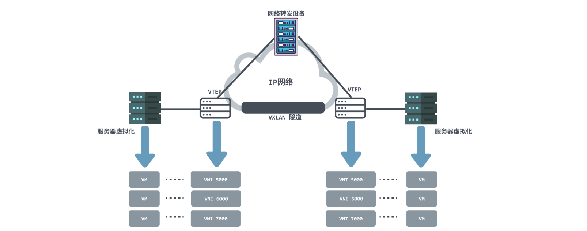
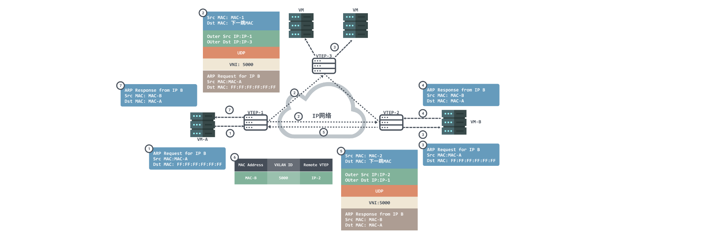
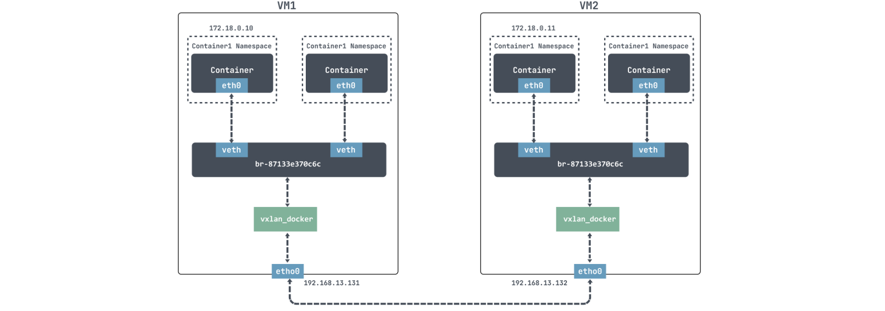
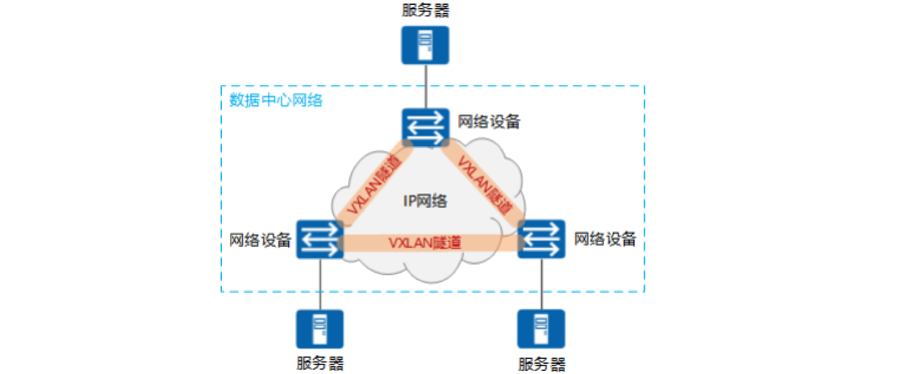
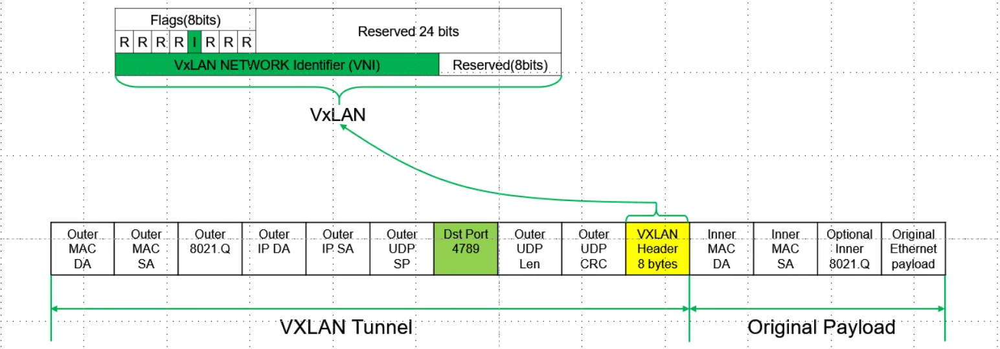
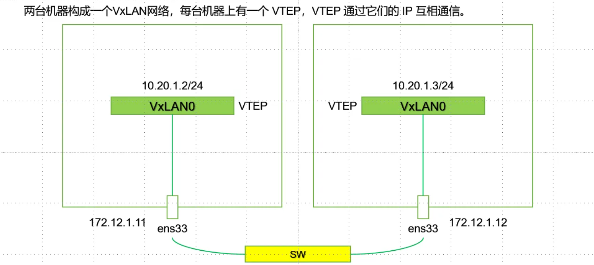
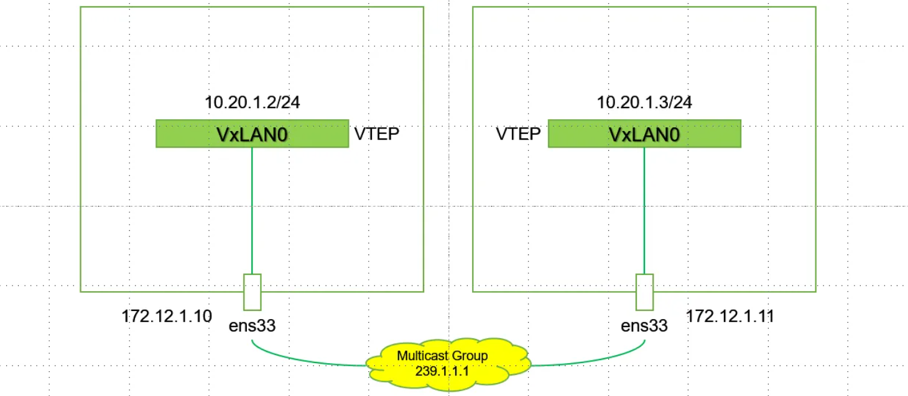

# 云原生虚拟网络之VXLAN 协议

## 1.VLAN概念

1. 在看 VXLAN 之前，先来看看VLAN。VLAN 的全称是“虚拟局域网”（Virtual Local Area Network），它是一个二层（数据链路层）的网络，用来分割广播域，因为随着计算机的增多，如果仅有一个广播域，会有大量的广播帧（如 ARP 请求、DHCP、RIP 都会产生广播帧）转发到同一网络中的所有客户机上。
2. 这样造成了没有必要的浪费，一方面广播信息消耗了网络整体的带宽，另一方面，收到广播信息的计算机还要消耗一部分CPU时间来对它进行处理。造成了网络带宽和CPU运算能力的大量无谓消耗。
3. 在这种情况下出现了 VLAN 技术。这种技术可以把一个 LAN 划分成多个逻辑的 VLAN ，每个 VLAN 是一个广播域，VLAN 内的主机间通信就和在一个 LAN 内一样，而 VLAN 间则不能直接互通，广播报文就被限制在一个 VLAN 内。如下图所示。

4. 然而 VLAN 有两个明显的缺陷，第一个缺陷在于 VLAN Tag 的设计，定义 VLAN 的 [802.1Q](https://en.wikipedia.org/wiki/IEEE_802.1Q)规范是在 1998 年提出的，只给 VLAN Tag 预留了 32 Bits 的存储空间，其中只有12 Bits 才能用来存储 VLAN ID。当云计算数据中心出现后，即使不考虑虚拟化的需求，单是需要分配 IP 的物理设备都有可能数以万计甚至数以十万计，这样 4096 个 VLAN 肯定是不够用的。
5. VLAN 第二个缺陷在于它本身是一个二层网络技术，但是在两个独立数据中心之间信息只能够通过三层网络传递，云计算的发展普及很多业务有跨数据中心运作的需求，所以数据中心间传递 VLAN Tag 又是一件比较麻烦的事情；并且在虚拟网络中，一台物理机会有多个容器，容器与 VM 相比也是呈数量级增长，每个虚拟机都有独立的 IP 地址和 MAC 地址，这样带给交换机的压力也是成倍增加。
6. 基于上面种种原因，VXLAN 也就呼之欲出了。

## 2.VXLAN概念

VXLAN（Virtual eXtensible LAN）虚拟可扩展局域网采用 L2 over L4 （MAC in UDP）的报文封装模式，把原本在二层传输的以太帧放到四层 UDP 协议的报文体内，同时加入了自己定义的 VXLAN Header。在 VXLAN Header 里直接就有 24 Bits 的 VLAN ID，同样可以存储 1677 万个不同的取值，VXLAN 让二层网络得以在三层范围内进行扩展，不再受数据中心间传输的限制。VXLAN 工作在二层网络（ IP 网络层），只要是三层可达（能够通过 IP 互相通信）的网络就能部署 VXLAN 。

### 2.1.工作模型

从上面图 VXLAN 网络网络模型中我们可以发现 VXLAN 网络中出现了以下几个组件：

1. VTEP（VXLAN Tunnel Endpoints，VXLAN隧道端点）：VXLAN 网络的边缘设备，是 VXLAN 隧道的起点和终点，负责 VXLAN 协议报文的**封包和解包**，也就是在虚拟报文上封装 VTEP 通信的报文头部。。VTEP 可以是网络设备（比如交换机），也可以是一台机器（比如虚拟化集群中的宿主机）；
2. VNI（VXLAN Network Identifier）：前文提到，以太网数据帧中VLAN只占了12比特的空间，这使得VLAN的隔离能力在数据中心网络中力不从心。而 VNI 的出现，就是专门解决这个问题的。一般每个 VNI 对应**一个租户**，并且它是个 24 位整数，也就是说使用 VXLAN 搭建的公有云可以理论上可以支撑最多**1677万级别的租户**；
3. VXLAN 隧道：隧道是一个逻辑上的概念，在 VXLAN 模型中并没有具体的物理实体想对应。隧道可以看做是一种虚拟通道，VXLAN 通信双方（图中的虚拟机）认为自己是在直接通信，并不知道底层网络的存在。从整体来说，每个 VXLAN 网络像是为通信的虚拟机搭建了一个单独的通信通道，也就是隧道；

### 2.2.通信过程

VXLAN 网络中通常 VTEP 可能会有多条隧道，VTEP 在进行通信前会通过查询转发表 FDB 来确定目标 VTEP 地址，转发表 FDB 用于保存远端虚拟机/容器的 MAC 地址，远端 VTEP IP，以及 VNI 的映射关系，而转发表通过泛洪和学习机制来构建。目标MAC地址在转发表中不存在的流量称为未知单播（Unknown unicast）。VXLAN 规范要求使用 IP 多播进行洪泛，将数据包发送到除源 VTEP 外的所有 VTEP。目标 VTEP 发送回响应数据包时，源 VTEP 从中学习 MAC 地址、VNI 和 VTEP 的映射关系，并添加到转发表中。

1. 由于是首次进行通信，VM-A 上没 VM-B 的 MAC 地址，所以会发送 ARP 广播报文请求 VM-B 的 MAC 地址。VM-A 发送源 MAC 为 VM-A 、目的 MAC 为全F、源 IP 为 IP-A、目的 IP 为 IP-B 的 ARP 广播报文，请求VM-B 的 MAC 地址；
2. VTEP-1 收到 ARP 请求后，根据二层子接口上的配置判断报文需要进入 VXLAN 隧道。VTEP-1 会对报文进行封装，封装的外层源 IP 地址为本地 VTEP（VTEP-1）的 IP 地址，外层目的 IP 地址为对端 VTEP（VTEP-2 和VTEP-3）的 IP 地址；外层源 MAC 地址为本地 VTEP 的 MAC 地址，而外层目的 MAC 地址为去往目的 IP 的网络中下一跳设备的 MAC 地址；
3. 报文到达VTEP-2和VTEP-3后，VTEP对报文进行解封装，得到VM-A发送的原始报文。然后 VTEP-2 和 VTEP-3 根据二层子接口上的配置对报文进行相应的处理并在对应的二层域内广播。VM-B 和 VM-C 接收到 ARP 请求后，比较报文中的目的IP地址是否为本机的IP地址。VM-C 发现目的IP不是本机IP，故将报文丢弃；VM-B 发现目的IP是本机IP，则对ARP请求做出应答；
4. VM-B 会根据请求的 ARP 包进行 ARP 应答报文为单播报文，报文源 MAC 为MAC-B，目的 MAC 为 MAC-A，源 IP 为 IP-B 、目的 IP 为 IP-A；
5. VTEP-2 接收到 VM-B 发送的 ARP 应答报文后，识别报文所属的 VNI，VTEP-2 对报文进行封装。封装的外层源IP地址为本地 VTEP（VTEP-2）的 IP 地址，外层目的IP地址为对端 VTEP（VTEP-1）的IP地址；外层源MAC地址为本地 VTEP 的 MAC 地址，而外层目的MAC地址为去往目的IP的网络中下一跳设备的MAC地址；
6. 报文到达 VTEP-1 后，VTEP-1 对报文进行解封装，得到 VM_B 发送的原始报文。同时，VTEP-1 学习VM_B 的MAC地址、VNI 和远端 VTEP 的IP地址（IP-2）的对应关系，并记录在本地 MAC 表中。之后，VTEP-1 将解封装后的报文发送给VM-A；
7. 至此，VM-A 就收到了 ARP 广播报文响应 VM-B 的 MAC 地址；

### 2.3.案例

下面，我们自己动手弄一个 VXLAN 网络，然后抓包看一下，是不是和我们上面长篇大论讲述的结论是一致的。需要注意的是，在自己虚拟机上实验的时候，为了避免不必要的麻烦，记得关防火墙，centos命令是：`systemctl stop firewalld`

下面我们打算用 docker 来进行实验，思路就是在两个容器宿主机上各创建一个VXLAN接口，并且将VXLAN接口接入docker网桥的端口上，如下图：

对于 docker 来说，是无法直接跨节点通信的，我们这里使用 VXLAN 来模拟跨节点通信。

docker 默认使用的是 172.17.0.0/16 网段，docker容器的IP地址都会从 172.17.0.2 开始分配。为了能利用–ip参数自定义IP地址的功能，需要先创建一个自定义网络，指定网段172.18.0.0/16。

~~~shell
[root@localhost ~]# docker network create --subnet 172.18.0.0/16 mynetwork

## mynetwork 新的bridge网络被创建
[root@localhost ~]# docker network ls
NETWORK ID     NAME        DRIVER    SCOPE
eb07bfe03ee3   bridge      bridge    local
7014433d34cf   host        host      local
87133e370c6c   mynetwork   bridge    local
82472e531205   none        null      local

[root@localhost ~]# brctl show
bridge name     bridge id               STP enabled     interfaces
br-87133e370c6c         8000.0242233b251a       no              veth385f866
                                                        vxlan_docker
docker0         8000.024213087f4b       no

## VM1
[root@localhost ~]# docker run -itd --net mynetwork --ip 172.18.0.10 centos

## VM2
[root@localhost ~]# docker run -itd --net mynetwork --ip 172.18.0.11 centos

--net指定自定义网络
--ip指定IP地址
centos指定image
~~~

上面我们虽然创建好了网络，但是我们直接进去是无法通信的：

~~~shell
[root@localhost ~]#  docker exec -it 5a2e519610bb /bin/bash

[root@5a2e519610bb /]# ping  172.18.0.11
PING 172.18.0.11 (172.18.0.11) 56(84) bytes of data.
From 172.18.0.10 icmp_seq=1 Destination Host Unreachable

--- 172.18.0.11 ping statistics ---
11 packets transmitted, 0 received, +8 errors, 100% packet loss, time 10007ms
pipe 4
~~~

下面我们在两个容器宿主机上各创建一个VXLAN接口，并且将VXLAN接口接入docker网桥的端口上：

~~~shell
## VM1
[root@localhost ~]#  ip link add vxlan_docker type vxlan id 200 remote 192.168.13.132 dstport 4789 dev ens33
[root@localhost ~]#  ip link set vxlan_docker up
[root@localhost ~]#  brctl addif br-87133e370c6c vxlan_docker

## VM2
[root@localhost ~]#  ip link add vxlan_docker type vxlan id 200 remote 192.168.13.131 dstport 4789 dev ens33
[root@localhost ~]#  ip link set vxlan_docker up
[root@localhost ~]#  brctl addif br-26d918129b18 vxlan_docker
~~~

上面我们分别使用 `ip link add`为 VM1 和 VM2 分别创建了创建 VNI 为200的 VXLAN 网络接口，名称为vxlan_docker；然后使用 `brctl addif `把新创建的VXLAN接口vxlan_docker接入到 docker 网桥中。

~~~shell
[root@5a2e519610bb /]# ping  172.18.0.11
PING 172.18.0.11 (172.18.0.11) 56(84) bytes of data.
64 bytes from 172.18.0.11: icmp_seq=1 ttl=64 time=1.14 ms
64 bytes from 172.18.0.11: icmp_seq=2 ttl=64 time=0.620 ms
^C
--- 172.18.0.11 ping statistics ---
2 packets transmitted, 2 received, 0% packet loss, time 1002ms
rtt min/avg/max/mdev = 0.620/0.879/1.139/0.261 ms
~~~

## 3.为什么需要 VXLAN

1. RFC定义了VLAN扩展方案VXLAN（Virtual eXtensible Local Area Network，虚拟扩展局域网）。VXLAN采用MAC in UDP（User Datagram Protocol）封装方式，是NVO3（Network Virtualization over Layer 3）中的一种网络虚拟化技术。
2. 虚拟机规模受网络设备表项规格的限制。在传统二层网络环境下，数据报文是通过查询MAC地址表进行二层转发。服务器虚拟化后，VM的数量比原有的物理机发生了数量级的增长，伴随而来的便是VM网卡MAC地址数量的空前增加。而接入侧二层设备的MAC地址表规格较小，无法满足快速增长的VM数量。
3. 网络隔离能力有限。VLAN作为当前主流的网络隔离技术，在标准定义中只有12比特，因此可用的VLAN数量仅4096个。对于公有云或其它大型虚拟化云计算服务这种动辄上万甚至更多租户的场景而言，VLAN的隔离能力无法满足。
4. 虚拟机迁移范围受限。由于服务器资源等问题（如CPU过高，内存不够等），虚拟机迁移已经成为了一个常态性业务。虚拟机迁移是指将虚拟机从一个物理机迁移到另一个物理机。为了保证虚拟机迁移过程中业务不中断，则需要保证虚拟机的IP地址、MAC地址等参数保持不变，这就要求虚拟机迁移必须发生在一个二层网络中。而传统的二层网络，将虚拟机迁移限制在了一个较小的局部范围内。
5. 为了应对传统数据中心网络对服务器虚拟化技术的限制，VXLAN技术应运而生，其能够很好的解决上述问题。VXLAN将管理员规划的同一区域内的VM发出的原始报文封装成新的UDP报文，并使用物理网络的IP和MAC地址作为外层头，这样报文对网络中的其他设备只表现为封装后的参数。因此，极大降低了大二层网络对MAC地址规格的需求。
6. VXLAN引入了类似VLAN ID的用户标识，称为VXLAN网络标识VNI（VXLAN Network Identifier），由24比特组成，支持多达16M的VXLAN段，有效得解决了云计算中海量租户隔离的问题。
7. VXLAN将VM发出的原始报文进行封装后通过VXLAN隧道进行传输，隧道两端的VM不需感知传输网络的物理架构。这样，对于具有同一网段IP地址的VM而言，即使其物理位置不在同一个二层网络中，但从逻辑上看，相当于处于同一个二层域。即VXLAN技术在三层网络之上，构建出了一个虚拟的大二层网络，只要虚拟机路由可达，就可以将其规划到同一个大二层网络中。这就解决了虚拟机迁移范围受限问题。
8. 为了解决数据中心网络服务器虚拟化以及虚拟机不受限迁移问题，VXLAN特性应运而生。由于VXLAN特性在本质上属于一种VPN技术，因此，其同样能够应用在园区网络中，以实现分散物理站点之间的二层互联以及站点间的三层互联。

## 4.VxLAN 数据报文结构

~~~shell
# 一个完整的 vxlan 报文需要哪些信息：

1.内层报文：通信的虚拟机双方要么直接使用 IP 地址，要么通过 DNS 等方式已经获取了对方的 IP 地址，因此网络层地址已经知道。同一个网络的虚拟机需要通信，还需要知道对方虚拟机的 MAC 地址，vxlan 需要一个机制来实现传统网络 ARP 的功能

2.vxlan 头部：只需要知道 VNI，这一般是直接配置在 vtep 上的，要么是提前规划写死的，要么是根据内部报文自动生成的，也不需要担心

3.UDP 头部：最重要的是源地址和目的地址的端口，源地址端口是系统生成并管理的，目的端口也是写死的，比如 IANA 规定的 4789 端口，这部分也不需要担心

4.IP 头部：IP 头部关心的是 vtep 双方的 IP 地址，源地址可以很简单确定，目的地址是虚拟机所在地址宿主机 vtep 的 IP 地址，这个也需要由某种方式来确定

5.MAC 头部：如果 vtep 的 IP 地址确定了，MAC 地址可以通过经典的 ARP 方式来获取，毕竟 vtep 网络在同一个三层，经典网络架构那一套就能直接用了
~~~

## 5.点对点VxLAN模型

~~~shell
# 点对点VxLAN实现过程：
# node k8s-1:
ip link add vxlan0 type vxlan id 5 dstport 4789 remote 172.12.1.12 local 172.12.1.11 dev ens33
ip addr add 10.20.1.2/24 dev vxlan0
ip link set vxlan0 up
# node k8s-2:
ip link add vxlan0 type vxlan id 5 dstport 4789 remote 172.12.1.11 local 172.12.1.12 dev ens33
ip addr add 10.20.1.3/24 dev vxlan0
ip link set vxlan0 up

# 语句解释：
ip link add vxlan0 type vxlan id 5 dstport 4789 remote 172.12.1.11 local 172.12.1.12 dev ens33 
# 此前在veth pair中有介绍过：ip l a xx type xx 。所以这里我们看到的是：添加一个接口vxlan0，它的类型为vxlan。
ip addr add 10.20.1.3/24 dev vxlan0   # 为vxlan0接口配置ip地址。
ip link set vxlan0 up  # 设置其端口启动。

# 使用k8s-1节点上vxlan0接口：10.20.1.2去pingk8s-2节点上的vxlan0接口：10.20.1.3
# 1.首先数据包会由k8s-1-vxlan0网卡构建，此时S_IP，S_MAC,D_IP均有，但是D_MAC暂时没有。所以需要查询10.20.1.3对应的MAC地址。
  10.20.1.2    10.20.1.3
   [vxlan0]    [vxlan0]
      |           |
       -- [SW] --

~~~

## 6.Muticase VxLAN模型

~~~shell
# muticast vxlan配置：
# k8s-1
ip link add vxlan0 type vxlan id 6 dstport 4789 group 239.1.1.1 dev ens33
ip addr add 10.20.1.2/24 dev vxlan0
ip link set vxlan0 up

# k8s-2
ip link add vxlan0 type vxlan id 6 dstport 4789 group 239.1.1.1 dev ens33
ip addr add 10.20.1.3/24 dev vxlan0
ip link set vxlan0 up

ip link add vxlan0 type vxlan id 6 dstport 4789 group 239.1.1.1 dev ens33

这里最重要的参数是 group 239.1.1.1 表示把 vtep 加入到这个多播组。关于多播的原理和使用不是这篇文章的重点，这里选择的多播 IP 地址也没有特殊的含义，关于多播的内容可以自行了解。
分析这个模式下 vxlan 通信的过程：

在配置完成之后，vtep 通过 IGMP 加入同一个多播网络 239.1.1.1。

1.发送 ping 报文到 10.20.1.3，查看路由表，报文会从 vxlan0 发出去
2.内核发现 vxlan0 的 IP 是 10.20.1.2/24，和目的 IP 在同一个网段，所以在同一个局域网，需要知道对方的 MAC 地址，因此会发送 ARP 报文查询
3.ARP 报文源 MAC 地址为 vxlan0 的 MAC 地址，目的 MAC 地址为全 1 的广播地址
4.vxlan 根据配置（VNI 6）添加上头部
5.因为不知道对方 vtep 在哪台主机上，根据配置，vtep 会往多播地址 239.1.1.1 发送多播报文
6.多播组中所有的主机都会受到这个报文，内核发现是 vxlan 报文，会根据 VNI 发送给对应的 vtep
7.vtep 去掉 vxlan 头部，取出真正的 ARP 请求报文。同时 vtep 会记录 <源 MAC 地址 - vtep 所在主机 IP 地址> 信息到 fdb 表中
8.如果发现 ARP 不是发送给自己的，直接丢弃；如果是发送给自己的，则生成 ARP 应答报文
9.应答报文目的 MAC 地址是发送方 vtep 的 MAC 地址，而且 vtep 已经通过源报文学习到了 vtep 所在的主机，因此会直接单播发送给目的 vtep。因此 vtep 不需要多播，就能填充所有的头部信息
10.应答报文通过 underlay 网络直接返回给发送方主机，发送方主机根据 VNI 把报文转发给 vtep，vtep 解包取出 ARP 应答报文，添加 arp 缓存到内核。并根据报文学习到目的 vtep 所在的主机地址，添加到 fdb 表中
11.vtep 已经知道了通信需要的所有信息，后续 ICMP 的 ping 报文都是单播进行的
~~~

