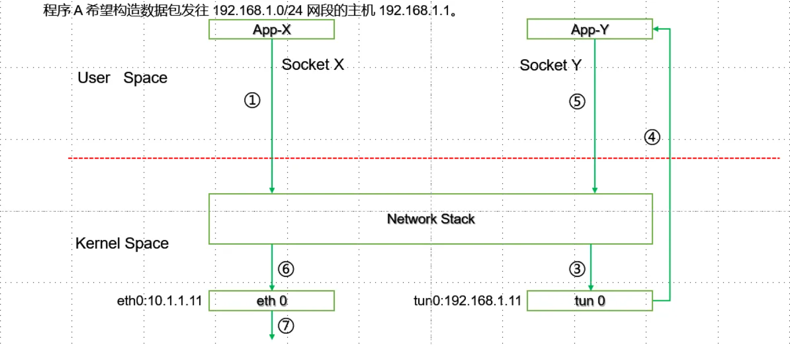

# UDP后端

## 1.UDP模式介绍

>1. UDP是与Docker网桥模式最相似的实现模式。不同的是，UDP模式在虚拟网桥基础上引入了TUN设备（flannel0）。TUN设备的特殊性在于它可以把数据包转给创建它的用户空间进程，从而实现内核到用户空间的拷贝。
>2. 在Flannel中，flannel0由flanneld进程创建，因此会把容器的数据包转到flanneld，然后由flanneld封包转给宿主机发向外部网络。
>3. **UDP转发的过程为**：
>   - Node1的Pod-1发起的IP包（目的地址为Node2的Pod-2）通过容器网关发到cni0，宿主机根据本地路由表将该包转到flannel0。
>   - 接着发给flanneld。Flanneld根据目的容器的容器子网与宿主机地址的关系（由etcd维护）获得目的宿主机地址，然后进行UDP封包，转给宿主机网卡通过物理网络传送到目标节点。
>   - 在UDP数据包到达目标节点后，根据对称过程进行解包，将数据传递给目标Pod。
>4. UDP模式使用了Flannel自定义的一种包头协议，实现三层网络Overlay网络处理跨主通信的问题。但是由于数据在内核和用户态经过了多次拷贝：容器是用户态，cni0和flannel0是内核态，flanneld是用户态，最终又要通过内核将数据发到外部网络，因此性能损耗较大，对于有数据传输有要求的在线业务并不适用。
>5. 每台主机的flanneld都监听着8285端口，所以flanneld只要把UDP发给其它Node的8285端口就可。然后该Node的flanneld再把IP包发送给它所管理的TUN设备flannel0，flannel0再发给cni0.最后由cni0网桥发给对应的Pod。

## 2.同节点同Pod不同容器之间的通信

1. 这个模式指定新创建的容器和已经存在的一个容器共享一个 Network Namespace，而不是和宿主机共享。新创建的容器不会创建自己的网卡，配置自己的 IP，而是和一个指定的容器共享 IP、端口范围等。同样，两个容器除了网络方面，其他的如文件系统、进程列表等还是隔离的。
2. 两个容器的进程可以通过 lo 网卡设备通信

1. kubernetes中的pod就是用这个实现的，同一个pod中的容器共享一个network namespace。container网络模式用于容器和容器直接频繁交流。
2. 当 Pod 被创建时，Kubernetes 会为其分配一个虚拟 IP 地址，这个 IP 地址会被 Flannel 管理。所有容器都共享这个 IP 地址。
3. 容器1 可以通过访问 `localhost:8081` 与容器2 进行通信，而容器2 则可以通过 `localhost:8080` 与容器1 进行通信。这种方式不需要网络封装，效率高。

## 3.同节点不同Pod之间的通信

1. 我们在ifconfig中看到的网卡都是在内核级别的，或是说在内核这个层面。通常情况下，在Flannel上解决同节点Pod之间的通信依赖的是Linux Bridge，在Docker中不同的是，在Kubernetes Flannel的环境中使用的Linux Bridge为cni0，而不是原来的docker0。
2. **Linux Bridge**：Linux Bridge 是 Linux 内核中的一个网络功能，用于在不同的网络接口之间转发数据包。它允许多个网络接口（如以太网接口、虚拟接口等）连接在一起，形成一个逻辑的网络。Linux Bridge 常用于虚拟化环境中，尤其是在使用 KVM、Docker 和其他容器技术时。
   - **工作原理**：
     - **数据包转发**：当数据包到达桥接接口时，Linux Bridge 会检查其 MAC 地址表。如果目标地址存在于表中，数据包会被转发到相应的接口。如果不存在，数据包会被广播到所有接口。
     - **MAC 地址学习**：每当数据包从某个接口到达时，Linux Bridge 会记录源 MAC 地址和对应的接口，以便在将来的数据包转发中使用。

>可通过：brctl  show查看对应的Linux Bridge的bridge name和interfaces。
>
>:bell:似乎rhel8以上没有工具包

~~~shell
root@k8s-worker01 /mnt # wget ftp://ftp.icm.edu.pl/packages/linux-pbone/archive.fedoraproject.org/epel/8.8.2023-11-14/Everything/x86_64/Packages/b/bridge-utils-1.7.1-2.el8.x86_64.rpm

root@k8s-worker01 /mnt # rpm -ivh bridge-utils-1.7.1-2.el8.x86_64.rpm 
Verifying...                          ################################# [100%]
Preparing...                          ################################# [100%]
Updating / installing...
   1:bridge-utils-1.7.1-2.el8         ################################# [100%]
   
  
root@k8s-worker01 /mnt # brctl show
bridge name     bridge id               STP enabled     interfaces
cni0            8000.86f1053b61b7       no              veth04d63dbd  ## cni0 为Linux下的一个虚拟Bridge。
                                                        veth569655f5
                                                        veth56a6218d
docker0         8000.024280424760       no

## 此时需要弄清楚两个问题：
	1.此时如何知道Pod中的eth0的pair是谁？
	2.此时由Pod-1进入内核，如果想要把数据包转发给另外一个Pod-2？

## 1.使用ethtool -S eth0
[root@k8s-1 ~]# kubectl exec -it cni-59h6g  bash 
bash-5.1# ethtool -S eth0
NIC statistics:
     peer_ifindex: 6   ##此时在Pod中查看peer的index为6.我们可以在ROOT NS中查看，ifindex为6的网卡。
     rx_queue_0_xdp_packets: 0
     rx_queue_0_xdp_bytes: 0
     rx_queue_0_drops: 0
     rx_queue_0_xdp_redirect: 0
     rx_queue_0_xdp_drops: 0
     rx_queue_0_xdp_tx: 0
     rx_queue_0_xdp_tx_errors: 0
     tx_queue_0_xdp_xmit: 0
     tx_queue_0_xdp_xmit_errors: 0
bash-5.1# exit

[root@k8s-1 ~]# ip a 
1: lo: <LOOPBACK,UP,LOWER_UP> mtu 65536 qdisc noqueue state UNKNOWN group default qlen 1000
    link/loopback 00:00:00:00:00:00 brd 00:00:00:00:00:00
    inet 127.0.0.1/8 scope host lo
       valid_lft forever preferred_lft forever
    inet6 ::1/128 scope host 
       valid_lft forever preferred_lft forever
2: ens33: <BROADCAST,MULTICAST,UP,LOWER_UP> mtu 1500 qdisc pfifo_fast state UP group default qlen 1000
    link/ether 00:0c:29:bd:fb:4a brd ff:ff:ff:ff:ff:ff
    inet 172.12.1.11/24 brd 172.12.1.255 scope global noprefixroute ens33
       valid_lft forever preferred_lft forever
    inet6 fe80::e222:32bb:f400:f0c3/64 scope link noprefixroute 
       valid_lft forever preferred_lft forever
3: docker0: <NO-CARRIER,BROADCAST,MULTICAST,UP> mtu 1500 qdisc noqueue state DOWN group default 
    link/ether 02:42:da:0c:a5:79 brd ff:ff:ff:ff:ff:ff
    inet 172.17.0.1/16 brd 172.17.255.255 scope global docker0
       valid_lft forever preferred_lft forever
4: flannel0: <POINTOPOINT,MULTICAST,NOARP,UP,LOWER_UP> mtu 1472 qdisc pfifo_fast state UNKNOWN group default qlen 500
    link/none 
    inet 10.244.0.0/32 brd 10.244.0.0 scope global flannel0
       valid_lft forever preferred_lft forever
    inet6 fe80::9af7:c926:3592:e41f/64 scope link flags 800 
       valid_lft forever preferred_lft forever
5: cni0: <BROADCAST,MULTICAST,UP,LOWER_UP> mtu 1472 qdisc noqueue state UP group default qlen 1000
    link/ether 1e:db:12:e1:c0:79 brd ff:ff:ff:ff:ff:ff
    inet 10.244.0.1/24 brd 10.244.0.255 scope global cni0
       valid_lft forever preferred_lft forever
    inet6 fe80::1cdb:12ff:fee1:c079/64 scope link 
       valid_lft forever preferred_lft forever
6: veth54a9e98a@if3: <BROADCAST,MULTICAST,UP,LOWER_UP> mtu 1472 qdisc noqueue master cni0 state UP group default   # 这里的ifindex为6.
    link/ether 66:c5:ab:c8:03:4e brd ff:ff:ff:ff:ff:ff link-netnsid 0
    inet6 fe80::64c5:abff:fec8:34e/64 scope link 
       valid_lft forever preferred_lft forever
       
[root@k8s-1 ~]# brctl show 
bridge name     bridge id               STP enabled     interfaces
cni0            8000.1edb12e1c079       no              veth54a9e98a # 此时该接口是在cni0这个bridge上。
docker0         8000.0242da0ca579       no

## 2.下边以两个在同一个节点上的两个Pod的情况分析
10.244.1.10  10.244.1.7
    [ns1]      [ns2]
      |          |
      -- [cni0] --
      
[root@k8s-1 ~]# kubectl get pods -o wide | grep k8s-2
cc          1/1     Running   0          32h    10.244.1.10   k8s-2   <none>           <none>
cni-svtwf   1/1     Running   1          109d   10.244.1.7    k8s-2   <none>           <none>
## 在pod cni-svtwf中去ping cc这个pod。抓包显示为：
[root@k8s-1 ~]#  kubectl exec -it cni-svtwf  bash 
kubectl exec [POD] [COMMAND] is DEPRECATED and will be removed in a future version. Use kubectl exec [POD] -- [COMMAND] instead.
bash-5.1# tcpdump -n -e  -i  eth0      
tcpdump: verbose output suppressed, use -v[v]... for full protocol decode
listening on eth0, link-type EN10MB (Ethernet), snapshot length 262144 bytes
14:31:06.751041 9a:16:45:30:3a:c6 > ee:6f:75:01:ed:bb, ethertype IPv4 (0x0800), length 98: 10.244.1.7 > 10.244.1.10: ICMP echo request, id 17920, seq 0, length 64
14:31:06.751096 ee:6f:75:01:ed:bb > 9a:16:45:30:3a:c6, ethertype IPv4 (0x0800), length 98: 10.244.1.10 > 10.244.1.7: ICMP echo reply, id 17920, seq 0, length 64
^C

#从抓包可以看出，cni-svtwf 的eth0的网卡的MAC地址为：9a:16:45:30:3a:c6
                cc 的eth0的网卡的MAC地址为：ee:6f:75:01:ed:bb
此时我们在cni0 bridge中查看MAC地址表：
[root@k8s-2 ~]# brctl showmacs cni0
port no mac addr                is local?       ageing timer
  1     1e:89:b9:2c:44:b1       yes                0.00
  1     1e:89:b9:2c:44:b1       yes                0.00
  3     32:2e:01:1d:a1:53       yes                0.00
  3     32:2e:01:1d:a1:53       yes                0.00
  2     4a:bc:c1:08:30:04       no                 1.70
  2     5e:14:4c:e2:2b:22       yes                0.00
  2     5e:14:4c:e2:2b:22       yes                0.00
  3     9a:16:45:30:3a:c6       no                32.42   # 此地址对应 cni-svtwf的eht0 MAC地址，对应bridge上的端口3.
  4     b2:8e:21:90:45:39       yes                0.00
  4     b2:8e:21:90:45:39       yes                0.00
  1     ce:22:d7:ee:59:7d       no                 1.70
  4     ee:6f:75:01:ed:bb       no                32.42   # 此地址对应cc 的eth0 的MAC地址，对应bridge上的端口4.
~~~

## 4.不同节点不同Pod之间的通信

1. 当 Pod A（位于节点 1 的某个 IP 地址上）需要与 Pod B（位于节点 2 的 IP 地址上）通信时：
   - Pod A 通过 `cni0` 网桥发送数据包到 Pod B 的 IP 地址。
   - Flannel 的网络代理（通常运行在每个节点上）会检测到目标地址是一个外部 Pod IP，因此需要进行跨节点通信。
   - Flannel 将数据包封装为 UDP 数据包，源 IP 是 Pod A 的 IP 地址，目标 IP 是 Pod B 的 IP 地址。封装后的数据包将通过节点 1 的物理网络接口（如 `eth0`）发送到节点 2。
   - 数据包经过网络转发到达节点 2。在节点 2 上，Flannel 的代理接收到 UDP 数据包，并解封装。Flannel 代理从 UDP 数据包中提取原始数据包，并通过 `cni0` 网桥转发到 Pod B。

~~~shell
## 此例子以cni-59h6g ping cni-svtwf 的过程分析：
[root@k8s-1 ~]# kubectl get pods -o wide 
NAME        READY   STATUS    RESTARTS   AGE    IP            NODE    NOMINATED NODE   READINESS GATES
cni-59h6g   1/1     Running   1          109d   10.244.0.3    k8s-1   <none>           <none>
cni-svtwf   1/1     Running   1          109d   10.244.1.7    k8s-2   <none>           <none>

## 到达宿主机以后，宿主机启动路由表查询过程。
[root@k8s-1 ~]# route -n 
Kernel IP routing table
Destination     Gateway         Genmask         Flags Metric Ref    Use Iface
0.0.0.0         172.12.1.2      0.0.0.0         UG    100    0        0 ens33
10.244.0.0      0.0.0.0         255.255.255.0   U     0      0        0 cni0
10.244.0.0      0.0.0.0         255.255.0.0     U     0      0        0 flannel0  # 此时查询路由表，达到10.244.1.7的被匹配到这条路由。此条掩码为16位。
172.12.1.0      0.0.0.0         255.255.255.0   U     100    0        0 ens33
172.17.0.0      0.0.0.0         255.255.0.0     U     0      0        0 docker0

## flannel0为tun设备，发送给flannel0接口的RAW IP包（无MAC信息）将被flanneld进程接收到，flanneld进程接收到RAW IP包后在原有的基础上进行UDP封包.UDP封包的形式为：172.12.1.11:src port -> 172.12.1.12:8285。

## 此时在flannel0上抓包：
[root@k8s-1 ~]# tcpdump -n -e -i flannel0
tcpdump: verbose output suppressed, use -v or -vv for full protocol decode
listening on flannel0, link-type RAW (Raw IP), capture size 262144 bytes  # link-type RAW (Raw IP)此为RAW Data。
23:29:31.058894 ip: 10.244.0.3 > 10.244.1.7: ICMP echo request, id 11264, seq 0, length 64
23:29:31.059734 ip: 10.244.1.7 > 10.244.0.3: ICMP echo reply, id 11264, seq 0, length 64

1. flanneld在启动时会将该节点的网络信息通过api-server保存到etcd当中，故在发送报文时可以通过查询etcd得到10.244.1.7这个容器的IP属于172.12.1.12。
2. flanneld将封装好的UDP报文从用户空间发往Linux内核协议栈，然后经ens33发出，从这里可以看出网络包在通过ens33发出前先是加上了UDP头（8个字节），再然后加上了IP头（20个字节）进行封装，这也是为什么flannel0的MTU要比ens33的MTU小28个字节的原因（防止封装后的以太网帧超过ens33的MTU而在经过ens33时被丢弃）
~~~

>:bell:flannel本来是vxlan，修改配置并kubectl apply，直接能转化为UDP模式么？
>
>1. **网卡的重新创建与管理**
>   - **VXLAN 模式**：在 VXLAN 模式下，Flannel 使用 VXLAN 隧道技术来封装和传输跨节点的流量，依赖内核支持的 `flannel.1` 网络接口。
>   - **DP 模式**：在 UDP 模式下，Flannel 通过 UDP 封装流量，并使用 `cni0` 等网络接口。切换模式会涉及到不同虚拟网卡的创建和配置。
>   - 从 VXLAN 模式切换到 UDP 模式时，Flannel 需要删除原有的 `flannel.1` 网卡，重新创建 `cni0` 等新虚拟网卡。这个过程中如果处理不当，容易导致网络中断、路由错误、Pod 失去网络连接等问题。
>2.  **IP 分配与冲突**
>   - Flannel 的不同模式会影响 IP 分配和管理。当你从 VXLAN 切换到 UDP 模式时，IP 分配策略可能会发生变化，容易导致 IP 地址冲突或 Pod 无法访问的问题。
>3. **路由表更新与数据包传输**
>   - 在 Flannel 中，网络模式的变化会引发路由表的更新，不同模式下的封装和解封装方式不同，直接切换可能导致错误的路由和数据包丢失。
>4. **建议的做法**：
>   - **新建节点**：在需要切换 Flannel 模式的集群中，建议逐步在新节点上部署新的 Flannel 配置（UDP 模式），同时迁移工作负载，避免直接对运行中的节点进行网络模式切换。
>   - **准备网络调整窗口**：如果必须切换，可以考虑在低流量时段进行，且要提前做好备份和容错方案，防止因网络中断造成严重影响。
>   - **回滚机制**：确保有完善的回滚机制，在切换过程中如果出现严重问题，能够快速恢复到之前的网络配置。

## 5.TUN设备

1. tap/tun 提供了一台主机内用户空间的数据传输机制。它虚拟了一套网络接口，这套接口和物理的接口无任何区别，可以配置 IP，可以路由流量，不同的是，它的流量只在主机内流通。
2. 作为网络设备，tap/tun 也需要配套相应的驱动程序才能工作。**tap/tun 驱动程序包括两个部分，一个是字符设备驱动，一个是网卡驱动。这两部分驱动程序分工不太一样，字符驱动负责数据包在内核空间和用户空间的传送，网卡驱动负责数据包在 TCP/IP 网络协议栈上的传输和处理**。

>:bell:如何去区分这样的2层的TAP和3层的TUN设备呢？
>
>1. tap/tun 有些许的不同，tun 只操作三层的 IP 包，而 tap 操作二层的以太网帧。
>2. 其中在veth pair的实验中，每一个vetp设备可以看做成一个tap设备，此时处理的时候，其主要是在处理2层的MAC地址层的数据包。
>3. 其中在Flannel的UDP Mode中的flannel0就是一个TUN设备：

~~~shell
[root@k8s-1 ~]# ip -d link show flannel0
4: flannel0: <POINTOPOINT,MULTICAST,NOARP,UP,LOWER_UP> mtu 1472 qdisc pfifo_fast state UNKNOWN mode DEFAULT group default qlen 500
link/none  promiscuity 0 
tun addrgenmode random numtxqueues 1 numrxqueues 1 gso_max_size 65536 gso_max_segs 65535 
       2.2：也可通过抓包可以看出，此时处理的是一个RAW格式数据包，但无2层MAC信息。只有3层的IP信息。
[root@k8s-1 ~]# tcpdump  -i flannel0 -w flannel.cap
tcpdump: listening on flannel0, link-type #RAW (Raw IP)#, capture size 262144 bytes
~~~

>4. un和tap都是虚拟网卡设备：
>   - tun是三层设备，其封装的外层是IP头。
>   - tap是二层设备，其封装的外层是以太网帧(frame)头。
>   - tun是PPP点对点设备，没有MAC地址。
>   - tap是以太网设备，有MAC地址tap比tun更接近于物理网卡，可以认为，tap设备等价于去掉了硬件功能的物理网卡。
>     这意味着，如果提供了用户空间的程序去收发tun/tap虚拟网卡的数据，所收发的内容是不同的。
>   - 收发tun设备的用户程序，只能间接提供封装和解封数据包的IP头的功能；
>   - 收发tap设备的用户程序，只能间接提供封装和解封数据包的帧头的功能
>5. 当采用UDP模式时，flanneld进程在启动时会通过打开/dev/net/tun的方式生成一个TUN设备，TUN设备可以简单理解为Linux当中提供的一种内核网络与用户空间（应用程序）通信的一种机制，即应用可以通过直接读写tun设备的方式收发RAW IP包。

### 5.1.TUN设备应用举例-数据路径

~~~shell
1.应用程序 X 构造数据包，目的 IP 是 192.168.1.1，通过 socket X 将这个数据包发给协议栈。
2.协议栈根据数据包的目的 IP 地址，匹配路由规则，发现要从 tun0 出去。
3.tun0 发现自己的另一端被应用程序 Y 打开了，于是将数据发给程序 Y.
4.程序 Y 收到数据后，做一些跟业务相关的操作，然后构造一个新的数据包，源 IP 是 eth0 的 IP，目的 IP 是 10.1.1.0/24 的网关 10.1.1.1，封装原来的数据的数据包，重新发给协议栈。
5.协议栈再根据本地路由，将这个数据包从 eth0 发出。
~~~

## 6.Flannel UDP Mode-Data Path 

~~~shell
[root@k8s-1 ~]# kubectl get pods -o wide 
NAME        READY   STATUS    RESTARTS   AGE    IP           NODE    NOMINATED NODE   READINESS GATES
cni-59h6g   1/1     Running   1          112d   10.244.0.3   k8s-1   <none>           <none>
cni-svtwf   1/1     Running   1          112d   10.244.1.7   k8s-2   <none>           <none>

# 使用Pod cni-59h6g ping Pod cni-svtwf做数据包路径解析。
[root@k8s-1 ~]# kubectl exec -it cni-59h6g  -- ping 10.244.1.7
PING 10.244.1.7 (10.244.1.7): 56 data bytes
64 bytes from 10.244.1.7: seq=0 ttl=60 time=0.839 ms
^C
--- 10.244.1.7 ping statistics ---
1 packets transmitted, 1 packets received, 0% packet loss
round-trip min/avg/max = 0.839/0.839/0.839 ms
[root@k8s-1 ~]# 
 
# 1.Pod cni-59h6g的ip地址为10.244.0.3.此时和10.244.1.7有通信需求。
进Pod cni-59h6g中查看：
[root@k8s-1 ~]# 
[root@k8s-1 ~]# kubectl exec -it cni-59h6g  -- ifconfig    ## 地址为eth0接口上的10.244.0.3，且掩码为24为，也就是说目的地址10.244.1.7不是和自己在同一网段。
eth0      Link encap:Ethernet  HWaddr 6E:02:53:A8:05:0B  
          inet addr:10.244.0.3  Bcast:10.244.0.255  Mask:255.255.255.0
          UP BROADCAST RUNNING MULTICAST  MTU:1472  Metric:1
          RX packets:28 errors:0 dropped:0 overruns:0 frame:0
          TX packets:50 errors:0 dropped:0 overruns:0 carrier:0
          collisions:0 txqueuelen:0 
          RX bytes:2144 (2.0 KiB)  TX bytes:4396 (4.2 KiB)

lo        Link encap:Local Loopback  
          inet addr:127.0.0.1  Mask:255.0.0.0
          UP LOOPBACK RUNNING  MTU:65536  Metric:1
          RX packets:0 errors:0 dropped:0 overruns:0 frame:0
          TX packets:0 errors:0 dropped:0 overruns:0 carrier:0
          collisions:0 txqueuelen:1000 
          RX bytes:0 (0.0 B)  TX bytes:0 (0.0 B)
    
## 由于此前分析我们知道，该目的地址10.244.1.7和自己并不在一个网段，所以需要查询本地路由表。
[root@k8s-1 ~]# kubectl exec -it cni-59h6g  -- route -n   
Kernel IP routing table
Destination     Gateway         Genmask         Flags Metric Ref    Use Iface
0.0.0.0         10.244.0.1      0.0.0.0         UG    0      0        0 eth0    # 查询后匹配到词条记录。
10.244.0.0      0.0.0.0         255.255.255.0   U     0      0        0 eth0
10.244.0.0      10.244.0.1      255.255.0.0     UG    0      0        0 eth0

[root@k8s-1 ~]# 
# 四元组：
S_IP： 10.244.0.3         D_IP： 10.244.1.7
S_MAC: 6E:02:53:A8:05:0B  D_MAC: unknow.
# 要想发送完整的数据报文，我们需要完整的四元组信息。此时还缺少D_AMC。此时由Pod自身的路由信息可知需要把数据包转发到10.244.0.1这个地址上：所以我们需要把数据包发到我们的下一跳：10.244.0.1，此时我们需要知道10.244.0.1对应的MAC地址信息。
# 当本端不清楚对端的MAC地址信息时候，会通过发送ARP广播消息来查询：
[root@k8s-1 ~]# kubectl exec -it cni-59h6g  -- arp -n
Address                  HWtype  HWaddress           Flags Mask            Iface
10.244.0.1               ether   9a:fd:ce:36:6e:0a   C                     eth0
[root@k8s-1 ~]#
# 此时数据报文的封装形式应该为：[这里有一个前提，在三次转发的时候，S_IP和D_IP是不变]
S_IP： 10.244.0.3          D_IP： 10.244.1.7
S_MAC: 6E:02:53:A8:05:0B   D_MAC: 9a:fd:ce:36:6e:0a

# 抓包验证：
[root@k8s-1 ~]# kubectl exec -it cni-59h6g -- tcpdump -n -e -i eth0 
tcpdump: verbose output suppressed, use -v[v]... for full protocol decode
listening on eth0, link-type EN10MB (Ethernet), snapshot length 262144 bytes
04:55:54.074249 6e:02:53:a8:05:0b > 9a:fd:ce:36:6e:0a, ethertype IPv4 (0x0800), length 98: 10.244.0.3 > 10.244.1.7: ICMP echo request, id 22784, seq 0, length 64
04:55:54.074872 9a:fd:ce:36:6e:0a > 6e:02:53:a8:05:0b, ethertype IPv4 (0x0800), length 98: 10.244.1.7 > 10.244.0.3: ICMP echo reply, id 22784, seq 0, length 64

## 抓包显示为：
6e:02:53:a8:05:0b > 9a:fd:ce:36:6e:0a    <----->    10.244.0.3 > 10.244.1.7
9a:fd:ce:36:6e:0a > 6e:02:53:a8:05:0b    <----->    10.244.1.7 > 10.244.0.3

# 2.此时数据包被发送到cni0这张网卡上，也就意味着数据包到达ROOT NS中：
此时查询节点k8s-1上的路由表：
[root@k8s-1 ~]# route -n 
Kernel IP routing table
Destination     Gateway         Genmask         Flags Metric Ref    Use Iface
0.0.0.0         172.12.1.2      0.0.0.0         UG    100    0        0 ens33
10.244.0.0      0.0.0.0         255.255.255.0   U     0      0        0 cni0
10.244.0.0      0.0.0.0         255.255.0.0     U     0      0        0 flannel0  # 此时匹配到这条路由信息。[因为我们的目的路由是10.244.1.0/24]
172.12.1.0      0.0.0.0         255.255.255.0   U     100    0        0 ens33
172.17.0.0      0.0.0.0         255.255.0.0     U     0      0        0 docker0
~~~

>1. 数据报文将要从flannel0这个接口发送出去，而flannel0是由flanneld该进程在启动时候创建的一个tun设备：所以看到的数据包是RAP IP Data
>2. 需要数数据包从内核空间copy到我们用户空间的flanneld上去。由于flanneld进程会采用UDP来分装原始的ping包（ICMP包），所以会在其原始数据包外层再加上一层数据头。
>3. 数据报文交给flanneld进程，此时他需要指导内核去安装一定的数据形式，这里是UDP Mode来做数据包的封装。这里涉及一个问题,就是如何获取目的Pod所在的目的Node。因为封装的目的就是想要数据包的IP头能在外部的交换或是路由设备上进程数据转发。
>4. flanneld在启动时会将该节点的网络信息通过api-server保存到etcd当中，故在发送报文时可以通过查询etcd得到10.244.1.7这个Pod的IP属于172.12.1.12该Node。
>5. 所以在数据包在即将被封装的时候，这里就获取到了四元组信息：
>    S_IP： 172.12.1.11         D_IP：  172.12.1.12
>    S_MAC：00:0c:29:bd:fb:4a   D_MAC:  00:0c:29:e2:bf:86