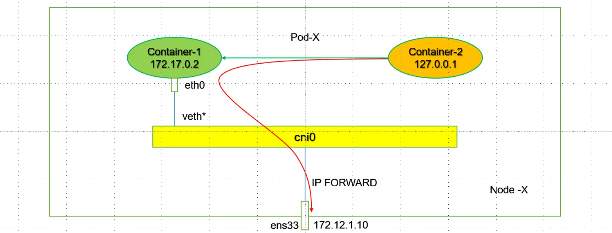
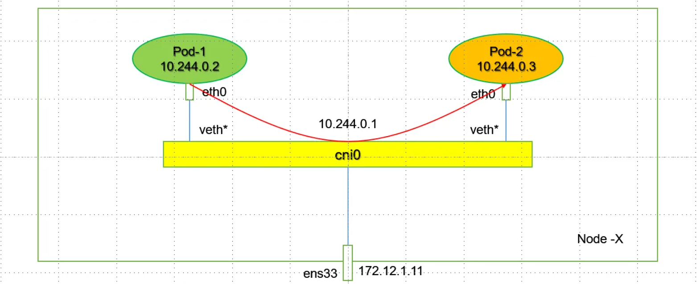
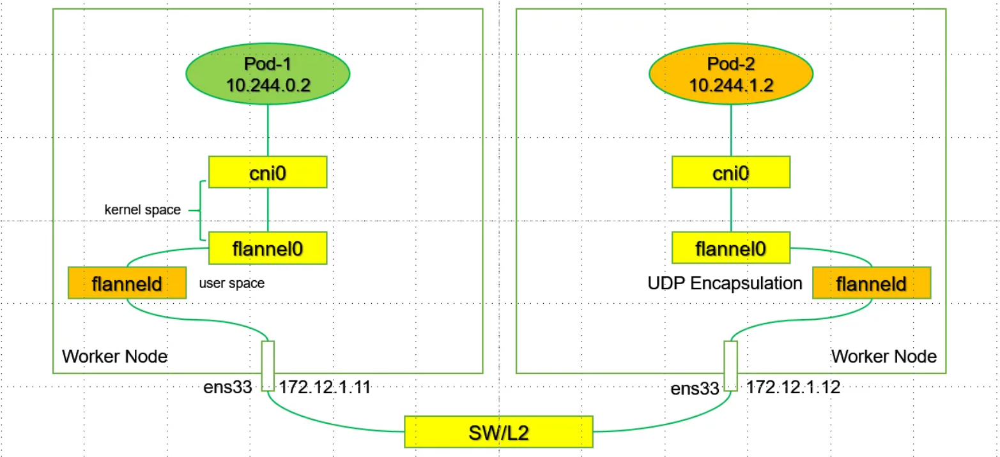

# UDP后端

## 1.UDP模式介绍

>1. UDP是与Docker网桥模式最相似的实现模式。不同的是，UDP模式在虚拟网桥基础上引入了TUN设备（flannel0）。TUN设备的特殊性在于它可以把数据包转给创建它的用户空间进程，从而实现内核到用户空间的拷贝。
>2. 在Flannel中，flannel0由flanneld进程创建，因此会把容器的数据包转到flanneld，然后由flanneld封包转给宿主机发向外部网络。
>3. **UDP转发的过程为**：
>   - Node1的Pod-1发起的IP包（目的地址为Node2的Pod-2）通过容器网关发到cni0，宿主机根据本地路由表将该包转到flannel0。
>   - 接着发给flanneld。Flanneld根据目的容器的容器子网与宿主机地址的关系（由etcd维护）获得目的宿主机地址，然后进行UDP封包，转给宿主机网卡通过物理网络传送到目标节点。
>   - 在UDP数据包到达目标节点后，根据对称过程进行解包，将数据传递给目标Pod。
>4. UDP模式使用了Flannel自定义的一种包头协议，实现三层网络Overlay网络处理跨主通信的问题。但是由于数据在内核和用户态经过了多次拷贝：容器是用户态，cni0和flannel0是内核态，flanneld是用户态，最终又要通过内核将数据发到外部网络，因此性能损耗较大，对于有数据传输有要求的在线业务并不适用。
>5. 每台主机的flanneld都监听着8285端口，所以flanneld只要把UDP发给其它Node的8285端口就可。然后该Node的flanneld再把IP包发送给它所管理的TUN设备flannel0，flannel0再发给cni0.最后由cni0网桥发给对应的Pod。

## 2.同节点同Pod不同容器之间的通信

1. 这个模式指定新创建的容器和已经存在的一个容器共享一个 Network Namespace，而不是和宿主机共享。新创建的容器不会创建自己的网卡，配置自己的 IP，而是和一个指定的容器共享 IP、端口范围等。同样，两个容器除了网络方面，其他的如文件系统、进程列表等还是隔离的。
2. 两个容器的进程可以通过 lo 网卡设备通信

1. kubernetes中的pod就是用这个实现的，同一个pod中的容器共享一个network namespace。container网络模式用于容器和容器直接频繁交流。
2. 当 Pod 被创建时，Kubernetes 会为其分配一个虚拟 IP 地址，这个 IP 地址会被 Flannel 管理。所有容器都共享这个 IP 地址。
3. 容器1 可以通过访问 `localhost:8081` 与容器2 进行通信，而容器2 则可以通过 `localhost:8080` 与容器1 进行通信。这种方式不需要网络封装，效率高。

## 3.同节点不同Pod之间的通信

1. 我们在ifconfig中看到的网卡都是在内核级别的，或是说在内核这个层面。通常情况下，在Flannel上解决同节点Pod之间的通信依赖的是Linux Bridge，在Docker中不同的是，在Kubernetes Flannel的环境中使用的Linux Bridge为cni0，而不是原来的docker0。
2. **Linux Bridge**：Linux Bridge 是 Linux 内核中的一个网络功能，用于在不同的网络接口之间转发数据包。它允许多个网络接口（如以太网接口、虚拟接口等）连接在一起，形成一个逻辑的网络。Linux Bridge 常用于虚拟化环境中，尤其是在使用 KVM、Docker 和其他容器技术时。
   - **工作原理**：
     - **数据包转发**：当数据包到达桥接接口时，Linux Bridge 会检查其 MAC 地址表。如果目标地址存在于表中，数据包会被转发到相应的接口。如果不存在，数据包会被广播到所有接口。
     - **MAC 地址学习**：每当数据包从某个接口到达时，Linux Bridge 会记录源 MAC 地址和对应的接口，以便在将来的数据包转发中使用。

>可通过：brctl  show查看对应的Linux Bridge的bridge name和interfaces。
>
>:bell:似乎rhel8以上没有工具包

~~~shell
root@k8s-worker01 /mnt # wget ftp://ftp.icm.edu.pl/packages/linux-pbone/archive.fedoraproject.org/epel/8.8.2023-11-14/Everything/x86_64/Packages/b/bridge-utils-1.7.1-2.el8.x86_64.rpm

root@k8s-worker01 /mnt # rpm -ivh bridge-utils-1.7.1-2.el8.x86_64.rpm 
Verifying...                          ################################# [100%]
Preparing...                          ################################# [100%]
Updating / installing...
   1:bridge-utils-1.7.1-2.el8         ################################# [100%]
   
  
root@k8s-worker01 /mnt # brctl show
bridge name     bridge id               STP enabled     interfaces
cni0            8000.86f1053b61b7       no              veth04d63dbd  ## cni0 为Linux下的一个虚拟Bridge。
                                                        veth569655f5
                                                        veth56a6218d
docker0         8000.024280424760       no

~~~

## 4.不同节点不同Pod之间的通信

1. 当 Pod A（位于节点 1 的某个 IP 地址上）需要与 Pod B（位于节点 2 的 IP 地址上）通信时：
   - Pod A 通过 `cni0` 网桥发送数据包到 Pod B 的 IP 地址。
   - Flannel 的网络代理（通常运行在每个节点上）会检测到目标地址是一个外部 Pod IP，因此需要进行跨节点通信。
   - Flannel 将数据包封装为 UDP 数据包，源 IP 是 Pod A 的 IP 地址，目标 IP 是 Pod B 的 IP 地址。封装后的数据包将通过节点 1 的物理网络接口（如 `eth0`）发送到节点 2。
   - 数据包经过网络转发到达节点 2。在节点 2 上，Flannel 的代理接收到 UDP 数据包，并解封装。Flannel 代理从 UDP 数据包中提取原始数据包，并通过 `cni0` 网桥转发到 Pod B。

