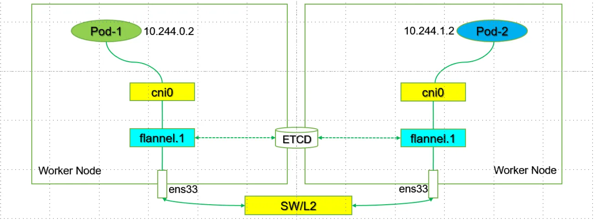

# VXLAN后端

1. 使用Linux内核中的vxlan模块封装隧道报文，以叠加网络模型支持跨节点的Pod间互联互通
2. 额外支持直接路由（Direct Routing）模式，该模式下位于同二层网络内的节点之上的Pod间通信可通过路由模式直接发送，而跨网络的节点之上的Pod间通信仍要使用VXLAN隧道协议转发
3. vxlan后端模式中，flanneld监听于8472/UDP发送封装的数据包；

## 1.准备环境

~~~shell
[root@k8s-1 ~]# kubectl get pods -o wide
NAME        READY   STATUS    RESTARTS   AGE    IP           NODE    NOMINATED NODE   READINESS GATES
cni-m9l94   1/1     Running   1          121d   10.244.1.5   k8s-2   <none>           <none>
cni-w4q8t   1/1     Running   1          121d   10.244.0.3   k8s-1   <none>           <none>

##1.两Pod的ip和mac信息：
[root@k8s-1 ~]# kubectl exec -it cni-w4q8t -- ifconfig 
eth0      Link encap:Ethernet  HWaddr CA:3A:FF:17:37:15  
          inet addr:10.244.0.3  Bcast:10.244.0.255  Mask:255.255.255.0
          UP BROADCAST RUNNING MULTICAST  MTU:1450  Metric:1
          RX packets:13 errors:0 dropped:0 overruns:0 frame:0
          TX packets:1 errors:0 dropped:0 overruns:0 carrier:0
          collisions:0 txqueuelen:0 
          RX bytes:1178 (1.1 KiB)  TX bytes:42 (42.0 B)
          
[root@k8s-1 ~]# kubectl exec -it cni-m9l94 -- ifconfig 
eth0      Link encap:Ethernet  HWaddr A6:73:A0:96:90:71  
          inet addr:10.244.1.5  Bcast:10.244.1.255  Mask:255.255.255.0
          UP BROADCAST RUNNING MULTICAST  MTU:1450  Metric:1
          RX packets:17 errors:0 dropped:0 overruns:0 frame:0
          TX packets:1 errors:0 dropped:0 overruns:0 carrier:0
          collisions:0 txqueuelen:0 
          RX bytes:1346 (1.3 KiB)  TX bytes:42 (42.0 B)
          
## 2.两节点的ip和mac信息：
[root@k8s-1 ~]# ifconfig 
cni0: flags=4163<UP,BROADCAST,RUNNING,MULTICAST>  mtu 1450
        inet 10.244.0.1  netmask 255.255.255.0  broadcast 10.244.0.255
        inet6 fe80::4cef:2cff:feeb:43e5  prefixlen 64  scopeid 0x20<link>
        ether 4e:ef:2c:eb:43:e5  txqueuelen 1000  (Ethernet)
        RX packets 1  bytes 28 (28.0 B)
        RX errors 0  dropped 0  overruns 0  frame 0
        TX packets 9  bytes 854 (854.0 B)
        TX errors 0  dropped 0 overruns 0  carrier 0  collisions 0

docker0: flags=4099<UP,BROADCAST,MULTICAST>  mtu 1500
        inet 172.17.0.1  netmask 255.255.0.0  broadcast 172.17.255.255
        ether 02:42:bc:2f:2a:a1  txqueuelen 0  (Ethernet)
        RX packets 0  bytes 0 (0.0 B)
        RX errors 0  dropped 0  overruns 0  frame 0
        TX packets 0  bytes 0 (0.0 B)
        TX errors 0  dropped 0 overruns 0  carrier 0  collisions 0

ens33: flags=4163<UP,BROADCAST,RUNNING,MULTICAST>  mtu 1500
        inet 172.12.1.11  netmask 255.255.255.0  broadcast 172.12.1.255
        inet6 fe80::e222:32bb:f400:f0c3  prefixlen 64  scopeid 0x20<link>
        ether 00:0c:29:bd:fb:4a  txqueuelen 1000  (Ethernet)
        RX packets 40142  bytes 15743486 (15.0 MiB)
        RX errors 0  dropped 0  overruns 0  frame 0
        TX packets 38970  bytes 16350462 (15.5 MiB)
        TX errors 0  dropped 0 overruns 0  carrier 0  collisions 0

flannel.1: flags=4163<UP,BROADCAST,RUNNING,MULTICAST>  mtu 1450
        inet 10.244.0.0  netmask 255.255.255.255  broadcast 10.244.0.0
        inet6 fe80::485:e5ff:fed3:67f1  prefixlen 64  scopeid 0x20<link>
        ether 06:85:e5:d3:67:f1  txqueuelen 0  (Ethernet)
        RX packets 0  bytes 0 (0.0 B)
        RX errors 0  dropped 0  overruns 0  frame 0
        TX packets 0  bytes 0 (0.0 B)
        TX errors 0  dropped 20 overruns 0  carrier 0  collisions 0
lo: flags=73<UP,LOOPBACK,RUNNING>  mtu 65536
        inet 127.0.0.1  netmask 255.0.0.0
        inet6 ::1  prefixlen 128  scopeid 0x10<host>
        loop  txqueuelen 1000  (Local Loopback)
        RX packets 2660454  bytes 430933651 (410.9 MiB)
        RX errors 0  dropped 0  overruns 0  frame 0
        TX packets 2660454  bytes 430933651 (410.9 MiB)
        TX errors 0  dropped 0 overruns 0  carrier 0  collisions 0

veth56a9232b: flags=4163<UP,BROADCAST,RUNNING,MULTICAST>  mtu 1450
        inet6 fe80::7871:dff:fe58:4e0b  prefixlen 64  scopeid 0x20<link>
        ether 7a:71:0d:58:4e:0b  txqueuelen 0  (Ethernet)
        RX packets 1  bytes 42 (42.0 B)
        RX errors 0  dropped 0  overruns 0  frame 0
        TX packets 13  bytes 1178 (1.1 KiB)
        TX errors 0  dropped 0 overruns 0  carrier 0  collisions 0
        
[root@k8s-2 ~]# ifconfig 
cni0: flags=4163<UP,BROADCAST,RUNNING,MULTICAST>  mtu 1450
        inet 10.244.1.1  netmask 255.255.255.0  broadcast 10.244.1.255
        inet6 fe80::dcb6:5cff:fec7:9e0e  prefixlen 64  scopeid 0x20<link>
        ether de:b6:5c:c7:9e:0e  txqueuelen 1000  (Ethernet)
        RX packets 39203  bytes 3173480 (3.0 MiB)
        RX errors 0  dropped 0  overruns 0  frame 0
        TX packets 40749  bytes 3603112 (3.4 MiB)
        TX errors 0  dropped 0 overruns 0  carrier 0  collisions 0

docker0: flags=4099<UP,BROADCAST,MULTICAST>  mtu 1500
        inet 172.17.0.1  netmask 255.255.0.0  broadcast 172.17.255.255
        ether 02:42:58:10:21:7e  txqueuelen 0  (Ethernet)
        RX packets 0  bytes 0 (0.0 B)
        RX errors 0  dropped 0  overruns 0  frame 0
        TX packets 0  bytes 0 (0.0 B)
        TX errors 0  dropped 0 overruns 0  carrier 0  collisions 0

ens33: flags=4163<UP,BROADCAST,RUNNING,MULTICAST>  mtu 1500
        inet 172.12.1.12  netmask 255.255.255.0  broadcast 172.12.1.255
        inet6 fe80::a9cd:74a4:47fc:9fec  prefixlen 64  scopeid 0x20<link>
        ether 00:0c:29:e2:bf:86  txqueuelen 1000  (Ethernet)
        RX packets 33691  bytes 15290649 (14.5 MiB)
        RX errors 0  dropped 0  overruns 0  frame 0
        TX packets 27396  bytes 3417296 (3.2 MiB)
        TX errors 0  dropped 0 overruns 0  carrier 0  collisions 0

flannel.1: flags=4163<UP,BROADCAST,RUNNING,MULTICAST>  mtu 1450
        inet 10.244.1.0  netmask 255.255.255.255  broadcast 10.244.1.0
        inet6 fe80::e049:6eff:fe06:dd0  prefixlen 64  scopeid 0x20<link>
        ether e2:49:6e:06:0d:d0  txqueuelen 0  (Ethernet)
        RX packets 0  bytes 0 (0.0 B)
        RX errors 0  dropped 0  overruns 0  frame 0
        TX packets 0  bytes 0 (0.0 B)
        TX errors 0  dropped 20 overruns 0  carrier 0  collisions 0
 
lo: flags=73<UP,LOOPBACK,RUNNING>  mtu 65536
        inet 127.0.0.1  netmask 255.0.0.0
        inet6 ::1  prefixlen 128  scopeid 0x10<host>
        loop  txqueuelen 1000  (Local Loopback)
        RX packets 145  bytes 10896 (10.6 KiB)
        RX errors 0  dropped 0  overruns 0  frame 0
        TX packets 145  bytes 10896 (10.6 KiB)
        TX errors 0  dropped 0 overruns 0  carrier 0  collisions 0

veth41525b19: flags=4163<UP,BROADCAST,RUNNING,MULTICAST>  mtu 1450
        inet6 fe80::c0c5:f1ff:fea5:92a7  prefixlen 64  scopeid 0x20<link>
        ether c2:c5:f1:a5:92:a7  txqueuelen 0  (Ethernet)
        RX packets 19579  bytes 1859591 (1.7 MiB)
        RX errors 0  dropped 0  overruns 0  frame 0
        TX packets 20383  bytes 1802251 (1.7 MiB)
        TX errors 0  dropped 0 overruns 0  carrier 0  collisions 0

veth5cdbe373: flags=4163<UP,BROADCAST,RUNNING,MULTICAST>  mtu 1450
        inet6 fe80::fc7b:c4ff:fe59:3814  prefixlen 64  scopeid 0x20<link>
        ether fe:7b:c4:59:38:14  txqueuelen 0  (Ethernet)
        RX packets 19623  bytes 1862689 (1.7 MiB)
        RX errors 0  dropped 0  overruns 0  frame 0
        TX packets 20388  bytes 1802573 (1.7 MiB)
        TX errors 0  dropped 0 overruns 0  carrier 0  collisions 0

veth756bf3bb: flags=4163<UP,BROADCAST,RUNNING,MULTICAST>  mtu 1450
        inet6 fe80::9886:bcff:fead:9d3f  prefixlen 64  scopeid 0x20<link>
        ether 9a:86:bc:ad:9d:3f  txqueuelen 0  (Ethernet)
        RX packets 1  bytes 42 (42.0 B)
        RX errors 0  dropped 0  overruns 0  frame 0
        TX packets 17  bytes 1346 (1.3 KiB)
        TX errors 0  dropped 0 overruns 0  carrier 0  collisions 0
~~~

## 2.Flannel VxLAN Mode跨节点通信原理解析-Packet Flow

~~~shell
#2.2:我们使用k8s-1上的pod cni-w4q8t 去ping k8s-2上的pod cni-m9l94对于pod cni-w4q8t 要去的目的地址10.244.1.5 和自己10.244.0.3并不是同一个网段，我们需要进行路由查询：
[root@k8s-1 ~]# kubectl exec -it cni-w4q8t -- route -n 
Kernel IP routing table
Destination     Gateway         Genmask         Flags Metric Ref    Use Iface
0.0.0.0         10.244.0.1      0.0.0.0         UG    0      0        0 eth0  
10.244.0.0      0.0.0.0         255.255.255.0   U     0      0        0 eth0
10.244.0.0      10.244.0.1      255.255.0.0     UG    0      0        0 eth0  # 此时路由显示去往10.244.0.0/16网络需要发给Gateway：10.244.0.1。

[root@k8s-1 ~]# 
所以需要查询Gateway 10.244.0.1所对应的MAC地址：
No.     Time                          Source                Destination           Protocol Length Info
#2       2021-07-26 18:14:46.315515    ca:3a:ff:17:37:15     Broadcast             ARP      42     Who has 10.244.0.1? Tell 10.244.0.3
Frame 2: 42 bytes on wire (336 bits), 42 bytes captured (336 bits)
Ethernet II, Src: ca:3a:ff:17:37:15 (ca:3a:ff:17:37:15), Dst: Broadcast (ff:ff:ff:ff:ff:ff)
Address Resolution Protocol (request)

No.     Time                          Source                Destination           Protocol Length Info
#3       2021-07-26 18:14:46.315527    4e:ef:2c:eb:43:e5     ca:3a:ff:17:37:15     ARP      42     10.244.0.1 is at 4e:ef:2c:eb:43:e5     # 此为 k8s-1节点上cni0的mac地址。
Frame 3: 42 bytes on wire (336 bits), 42 bytes captured (336 bits)
Ethernet II, Src: 4e:ef:2c:eb:43:e5 (4e:ef:2c:eb:43:e5), Dst: ca:3a:ff:17:37:15 (ca:3a:ff:17:37:15)
Address Resolution Protocol (reply)

No.     Time                          Source                Destination           Protocol Length Info
#4       2021-07-26 18:14:46.315529    10.244.0.3            10.244.1.5            ICMP     98     Echo (ping) request  id=0x5700, seq=0/0, ttl=64 (reply in 5)
Frame 4: 98 bytes on wire (784 bits), 98 bytes captured (784 bits)
Ethernet II, Src: ca:3a:ff:17:37:15 (ca:3a:ff:17:37:15), Dst: 4e:ef:2c:eb:43:e5 (4e:ef:2c:eb:43:e5)
Internet Protocol Version 4, Src: 10.244.0.3, Dst: 10.244.1.5
Internet Control Message Protocol

No.     Time                          Source                Destination           Protocol Length Info
#5       2021-07-26 18:14:46.316067    10.244.1.5            10.244.0.3            ICMP     98     Echo (ping) reply    id=0x5700, seq=0/0, ttl=62 (request in 4)
Frame 5: 98 bytes on wire (784 bits), 98 bytes captured (784 bits)
Ethernet II, Src: 4e:ef:2c:eb:43:e5 (4e:ef:2c:eb:43:e5), Dst: ca:3a:ff:17:37:15 (ca:3a:ff:17:37:15)
Internet Protocol Version 4, Src: 10.244.1.5, Dst: 10.244.0.3
Internet Control Message Protocol

#2.2：此时数据包送到ROOT NS中，那么就开始走ROOT NS的逻辑。查询路由表可得：
###需要注意的是：多条路由条目时候，除了网关很重要以外，出接口也非常的重要，因为直接决定从一个接口送出去，就意味着使用哪一个接口的MAC地址。
[root@k8s-1 ~]# route -n 
Kernel IP routing table
Destination     Gateway         Genmask         Flags Metric Ref    Use Iface
0.0.0.0         172.12.1.2      0.0.0.0         UG    100    0        0 ens33
10.244.0.0      0.0.0.0         255.255.255.0   U     0      0        0 cni0
10.244.1.0      10.244.1.0      255.255.255.0   UG    0      0        0 flannel.1   # 此条络由条目被匹配到，且需要走三层路由转发，且网关为10.244.1.0该地址，而此地址为k8s-2上的flannel.1网卡地址
172.12.1.0      0.0.0.0         255.255.255.0   U     100    0        0 ens33
172.17.0.0      0.0.0.0         255.255.0.0     U     0      0        0 docker0

由上述路由信息，我们可以得到两条重要信息：
   1: 网关是10.244.1.0 该地址是k8s-2节点上的flannel.1（VTEP）的地址。
   2. 数据的出接口为flannel.1。也就是说数据包要从此接口发出。
   
这里的转发：需要查询到地址10.244.1.0对应的MAC地址。
####################
根据路由表信息我们知道了目的VTEP设备的IP地址，而根据三层IP地址查询二层MAC地址正是ARP表的功能。 而这里用ARP表的记录，也就是flanneld进程在k8s-2节点启动时，自动添加到k8s-1上的.所以此时ARP的缓存就自动在k8s-1的节点上缓存下来了，也就意味着此时k8s-1不再需要查询ARP了。
####################
所以此时的数据报文形式为：
S_IP: 10.244.0.3       S_MAC: $k8s-1_flannel.1_MAC # [06:85:e5:d3:67:f1]
D_IP: 10.244.1.5       D_MAC: $k8s-2_flannel.1_MAC # [e2:49:6e:06:0d:d0]
抓包显示：
No.     Time                          Source                Destination           Protocol Length Info
1       2021-07-26 18:14:46.315561    10.244.0.3            10.244.1.5            ICMP     98     Echo (ping) request  id=0x5700, seq=0/0, ttl=63 (reply in 2)
Frame 1: 98 bytes on wire (784 bits), 98 bytes captured (784 bits)
Ethernet II, Src: 06:85:e5:d3:67:f1 (06:85:e5:d3:67:f1), Dst: e2:49:6e:06:0d:d0 (e2:49:6e:06:0d:d0)   # VTEP----S_MAC[$k8s-1_flannel.1] 和 D_MAC[$k8s-2_D_MAC_flannel.1]----VTEP
Internet Protocol Version 4, Src: 10.244.0.3, Dst: 10.244.1.5
Internet Control Message Protocol

No.     Time                          Source                Destination           Protocol Length Info
2       2021-07-26 18:14:46.316022    10.244.1.5            10.244.0.3            ICMP     98     Echo (ping) reply    id=0x5700, seq=0/0, ttl=63 (request in 1)
Frame 2: 98 bytes on wire (784 bits), 98 bytes captured (784 bits)
Ethernet II, Src: e2:49:6e:06:0d:d0 (e2:49:6e:06:0d:d0), Dst: 06:85:e5:d3:67:f1 (06:85:e5:d3:67:f1)
Internet Protocol Version 4, Src: 10.244.1.5, Dst: 10.244.0.3
Internet Control Message Protocol
~~~

