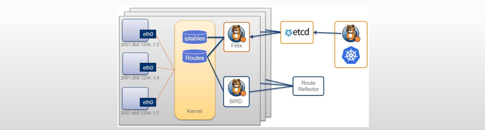

# Calico基础架构

## 1.Calico简介

1. 三层的虚拟网络方案，把每个节点都当作虚拟路由器（vRouter），把每个节点上的Pod都当作是“节点路由器”后的一个终端设备并为其分配一个IP地址。各节点路由器通过BGP（Border Gateway Protocol）协议学习生成路由规则从而实现不同节点上Pod间的互联互通。
2. Calico在每一个计算节点利用Linux内核实现了一个高效的vRouter（虚拟路由器）进行报文转发，而每个vRouter通过BGP协议负责把自身所属的节点上运行的Pod资源的IP地址信息基于节点的agent程序（Felix）直接由vRouter生成路由规则向整个Calico网络内传播。

## 2.Calico架构

- 概括来说，Calico主要由Felix、Orchestrator Plugin、etcd、BIRD和BGP Router Reflector等组件组成
  - Felix：Calico Agent，运行于每个节点，主要负责维护虚拟接口设备和路由信息
  - Orchestrator Plugin：编排系统（例如Kubernetes、OpenStack等）用于将Calico整合进行系统中的插件，例如Kubernetes的CNI
  - etcd：持久存储Calico数据的存储管理系统
  - BIRD：负责分发路由信息的BGP客户端
  - BGP Route Reflector：BGP路由反射器，可选组件，用于较大规模的网络场景

## 3.Calico的网络

- Calico的工作机制
  - Calico把Kubernetes集群环境中的每个节点上的Pod所组成的网络视为一个自治系统，各节点也就是各自治系统的边界网关，它们彼此间通过BGP协议交换路由信息生成路由规则；
  - 考虑到并非所有网络都能支持BGP，以及BGP路由模型要求所有节点必须要位于同一个二层网络，Calico还支持基于IPIP和VXLAN的叠加网络模型；
  - 类似于Flannel在VXLAN后端中启用DirectRouting时的网络模型，Calico也支持混合使用路由和叠加网络模型，BGP路由模型用于二层网络的高性能通信，IPIP或VXLAN用于跨子网的节点间（Cross-Subnet）报文转发。

## 4.部署Calico插件

1. 部署方式
   - Operator：由专用的Operator和CRD管理
   - Manifest：基于配置清单进行部署
     - 将Kubernetes API作为存储，节点数小于等于50
     - 将Kubernetes API作为存储，节点数大于50
2. 文档
   - https://docs.tigera.io/calico/latest/getting-started/kubernetes/self-managed-onprem/onpremises